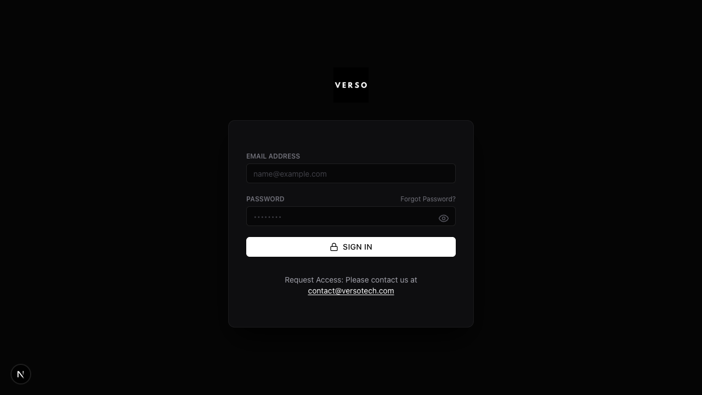

# Getting Started with Versotech

Welcome to **Versotech**, the investment operations platform by VERSO Holdings. This guide covers the essentials every user needs to know before diving into persona-specific workflows.

---

## First Login & Password Setup

### Receiving Your Invitation

1. You'll receive an email invitation from `noreply@versoholdings.com`
2. Click the **"Set Up Account"** link (valid for 24 hours)
3. Create a strong password (minimum 8 characters, mix of letters/numbers/symbols)
4. Complete the initial profile setup

### Logging In

*The Versotech login page with email and password fields.*

1. Navigate to [app.versoholdings.com](https://app.versoholdings.com)
2. Enter your **EMAIL ADDRESS**
3. Enter your **PASSWORD**
4. Click **"SIGN IN"**

> **Need Access?** Contact [contact@versotech.com](mailto:contact@versotech.com) to request an account.

### Forgot Password?

1. Click **"Forgot Password?"** on the login page
2. Enter your email address
3. Check your inbox for the reset link
4. Follow the link to create a new password

---

## Understanding Personas

A **persona** represents your role on the platform. Each persona has different capabilities and sees different dashboards.

### Available Personas

| Persona | Description |
|---------|-------------|
| **Investor** | View opportunities, subscribe to deals, manage portfolio |
| **Arranger** | Create vehicles/deals, manage data rooms, process subscriptions |
| **Introducer** | Make client introductions, track commissions |
| **Partner** | Co-arrange deals, receive partnership commissions |
| **Commercial Partner** | Distribute deals to investor network |
| **Lawyer** | Sign certificates, review legal documents |
| **CEO/Staff** | Approve workflows, manage users, oversee operations |

### Multiple Personas

Many users have **multiple personas**. For example:
- An arranger might also be an investor in their own deals
- An introducer might also have investor status
- Staff members often have CEO delegation for approvals

---

## Switching Personas

If you have multiple personas, you can switch between them:

1. Look for the **persona switcher** in the top navigation bar
2. Click on your current persona name
3. Select the persona you want to switch to from the dropdown
4. The dashboard will refresh to show your new view

> **Tip**: Each persona has its own dashboard and navigation. If you can't find something, check that you're in the correct persona.

---

## Platform Navigation

### Main Navigation Areas

The left sidebar provides access to major sections. What you see depends on your active persona:

**Common to All Personas:**
- **Dashboard** - Overview of your current status
- **Profile** - Your personal information and settings
- **Notifications** - Recent activity and alerts

**Persona-Specific Navigation:**

| Persona | Sidebar Menu Items |
|---------|-------------------|
| **Investor** | Dashboard, Investment Opportunities, Portfolio, Documents, Inbox, Profile |
| **Arranger** | Dashboard, My Mandates, Subscription Packs, Escrow, Reconciliation, Fee Plans, Payment Requests, My Partners, My Introducers, My Commercial Partners, My Lawyers, VERSOSign |
| **Introducer** | Dashboard, Introductions, Agreements, My Commissions, VersoSign, Profile |
| **Staff/CEO** | Dashboard, Approvals, Users, Entities, Accounts, Reconciliation, Audit, VERSOSign |

### Top Navigation Bar

- **Persona Switcher** - Switch between your roles
- **Notifications Bell** - Unread alerts and updates
- **Profile Menu** - Account settings, logout

### Quick Actions

Many pages have a **"+ New"** button or quick action menu in the top right. Use these for common tasks like:
- Creating new deals (Arranger)
- Recording new introductions (Introducer)
- Starting new subscriptions (Investor)

---

## Understanding Status Flows

Throughout the platform, you'll see status badges indicating where items are in their workflow:

### Subscription Status

The subscription workflow involves **three interconnected status systems**:

**Subscription Status** (financial lifecycle):
`pending` → `committed` → `partially_funded` → `funded` → `active` → `closed` or `cancelled`

**Submission Status** (staff review):
`pending_review` → `approved` or `rejected` or `cancelled`

**Pack Status** (document signing):
`no_pack` → `draft` → `final` → `pending_signature` → `signed`

### Deal Status
`draft` → `open` → `allocation_pending` → `fully_subscribed` → `closed`

### Interest Status
`pending_review` → `approved` or `rejected` or `withdrawn`

### KYC Status
`pending` → `submitted` → `approved` or `rejected` or `expired`

### Commission Status
`accrued` → `invoice_requested` → `invoice_submitted` → `invoiced` → `paid`

> **Note**: Commissions may also be `cancelled` or `rejected` if issues arise.

### Fee Plan Status
`draft` → `sent` → `pending_signature` → `accepted` or `rejected` or `archived`

---

## Getting Help

### In-Platform Support
- Look for the **"?"** icon for contextual help
- Check the notification center for updates

### Contact Support
- Email: support@versoholdings.com
- Response time: Within 24 business hours

---

## Next Steps

Navigate to your persona-specific guide to learn detailed workflows:

- [Investor Guides](./investor/)
- [Arranger Guides](./arranger/)
- [Introducer Guides](./introducer/)
- [Partner Guides](./partner/)
- [Commercial Partner Guides](./commercial-partner/)
- [Lawyer Guides](./lawyer/)
- [CEO & Staff Guides](./ceo-staff/)
