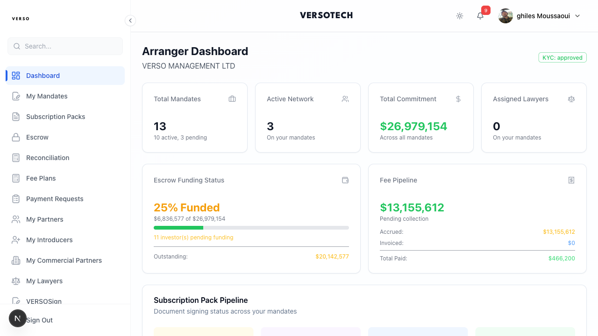

# Arranger Guide

Complete guide for arrangers - creating vehicles, structuring deals, managing networks, and closing transactions.


*The arranger dashboard with real deal data, escrow funding status, and fee pipeline metrics.*

---

## Your Sidebar Navigation

| Menu Item | Description |
|-----------|-------------|
| **Dashboard** | Overview and metrics |
| **My Mandates** | Your deals and mandates |
| **Subscription Packs** | Investor document packages |
| **Escrow** | Escrow account management |
| **Reconciliation** | Fund verification |
| **Fee Plans** | Commission agreements |
| **Payment Requests** | Payment approvals |
| **My Partners** | Strategic partners |
| **My Introducers** | Introducer network |
| **My Commercial Partners** | Distribution platforms |
| **My Lawyers** | Legal partners |
| **VERSOSign** | Document signing |

---

## Your Dashboard

As an arranger, your dashboard shows:
- Your vehicles and deals
- Subscription pipeline
- Fee plan status
- Network activity
- Pending actions

---

## 1. Creating Vehicles

A **Vehicle** is the fund structure that holds deals and investor positions.

### How to Create

1. **Vehicles** → **+ Create Vehicle**
2. Complete the form:

| Field | Required | Description |
|-------|----------|-------------|
| **Vehicle Name** | ✓ | Official name (e.g., "VERSO Tech Growth Fund I") |
| **Entity Code** | ✓ | Short identifier (e.g., "VTG-001") |
| **Jurisdiction** | ✓ | Registration country |
| **Currency** | ✓ | Base currency (USD, EUR, GBP) |
| **Vehicle Type** | ✓ | SPV, Fund, Trust, etc. |
| **Target Size** | | Fundraising target |
| **Description** | | Strategy and purpose |

### Assigning Service Providers

| Role | Purpose |
|------|---------|
| **Arranger** | You or your entity - manages the deal |
| **Lawyer** | Legal counsel - signs certificates |
| **Managing Partner** | Operations management |

**Note:** Service providers must exist as entities first. Create them via **Entities** → **+ Create Entity** if needed.

### What Vehicles Control

When you create deals in a vehicle, they inherit:
- Arranger (auto-populated)
- Lawyer (for certificate signing)
- Currency
- Minimum investment

---

## 2. Creating Deals

A **Deal** is a specific investment opportunity within a vehicle.

### 3-Step Creation Wizard

**Deals** → **+ Create Deal**

**Step 1: Basic Information**
| Field | Description |
|-------|-------------|
| Deal Name | Descriptive name (e.g., "Series B - TechCorp") |
| Vehicle | Select parent vehicle |
| Description | Investment thesis |
| Deal Type | Equity, Debt, Convertible, etc. |

**Step 2: Vehicle Selection**
- Select the parent vehicle for this deal
- The arranger is **auto-populated** from the vehicle
- Currency and settings inherit from vehicle

> **Note**: Investment terms (target amount, min/max investment, unit price, fees) are configured in the **Term Sheet** after deal creation—not in the deal form itself.

**Step 3: Timeline**
| Field | Description |
|-------|-------------|
| Open Date | When investors can access |
| Close Date | Deadline for subscriptions |
| Expected Settlement | When funds transfer |

### Deal Status Flow

```
DRAFT ──→ OPEN ──→ ALLOCATION_PENDING ──→ FULLY_SUBSCRIBED ──→ CLOSED
  │                                                               │
  │ (only you                                               (positions
  │  can see)                                                created,
  │                                                         commissions
  │                                                          generated)
  │
  └──→ CANCELLED
```

---

## 3. Managing Term Sheets

The **Term Sheet** defines investment terms investors will see.

### Creating a Term Sheet

**Deal Detail** → **Term Sheet** → **Create Term Sheet**

| Field | Description |
|-------|-------------|
| **Price per Share** | What investors pay |
| **Cost per Share** | Base cost (before spread) |
| **Subscription Fee** | One-time fee (% of investment) |
| **Management Fee** | Annual fee (% of AUM) |
| **Performance Fee** | Carry on profits |
| **Minimum Investment** | Smallest subscription |
| **Key Risks** | Material disclosures |

**Spread Calculation:**
```
Spread per Share = Price per Share - Cost per Share
```

### Publishing

1. Review all fields for accuracy
2. Click **Publish Term Sheet**
3. PDF generated for investors
4. Investors can now view terms

### Editing After Publication

- Minor updates: Edit and republish
- Major changes: Notify existing subscribers, may require re-consent

---

## 4. Setting Up Fee Plans

Fee plans define commission structures for introducers and partners.

> **⚠️ CRITICAL: Fee plans are DEAL-SPECIFIC, not templates.**
> Create a new fee plan for each deal. You cannot reuse fee plans across deals.

### Creating a Fee Plan

**Deal Detail** → **Fee Plans** → **+ Create Fee Plan**

| Field | Required | Description |
|-------|----------|-------------|
| **Entity** | ✓ | The introducer/partner earning commission |
| **Fee Type** | ✓ | subscription, management, performance |
| **Rate (bps)** | ✓ | Basis points (100 bps = 1%) |
| **Is Active** | ✓ | Whether to calculate commissions |

### Fee Plan Status Flow

```
DRAFT ──→ SENT ──→ ACCEPTED
               │
               └──→ REJECTED
```

### Sending for Acceptance

1. Create the fee plan
2. Click **Send for Acceptance**
3. Introducer receives notification
4. They review and accept/reject in their portal

**Requirement:** Fee plans must be **ACCEPTED** before deal close for commissions to be created.

### Commission Calculation

When deal closes:
```
Commission = funded_amount × (rate_bps / 10,000)
```

**Example:** $100,000 investment at 200 bps = $2,000 commission

> **Note:** Commission is ALWAYS based on `funded_amount`, never on management fees or other amounts.

---

## 5. Managing Your Network

### Adding Introducers

Click **"My Introducers"** in the sidebar, then **"+ Add Introducer"**

| Field | Description |
|-------|-------------|
| Name | Individual or company |
| Email | Contact email |
| Entity Type | Individual or Company |
| Default Rate | Starting commission rate |
| Bank Details | For payments |

### Introducer Agreements

Before introducers can earn commissions, they need a signed agreement.

**Creating an Agreement:**

1. Go to **My Introducers** → Select introducer → **"+ Create Agreement"**
2. Select **Introducer Agreement**
3. Choose the introducer entity
4. Upload or generate agreement document
5. Send for signature

**Signing Flow:**
```
You/CEO sign first (Party A)
        │
        ▼
Introducer signs (Party B)
        │
        ▼
Agreement becomes ACTIVE
```

**Requirement:** Agreement must be **ACTIVE** for commissions to be created.

### Recording Introductions

When an introducer brings a prospect:

**Network** → **Introductions** → **+ Add Introduction**

| Field | Description |
|-------|-------------|
| Introducer | Who made the referral |
| Prospect Name | Potential investor |
| Prospect Email | Contact email |
| Deal | Which opportunity |
| Notes | Context |

---

## 6. Dispatching Investors to Deals

**Dispatching** links an investor to a deal and assigns their fee plan for commission tracking.

### How to Dispatch

**Deal Detail** → **Members** → **+ Dispatch User**

| Field | Description |
|-------|-------------|
| **User** | The investor to add |
| **Role** | investor, introducer_investor, partner_investor |
| **Fee Plan** | Which fee plan governs commissions |
| **Referral Entity** | The introducer who referred them |

> **⚠️ CRITICAL:** If you don't assign a fee plan during dispatch, NO commission will be created at deal close.

---

## 7. Opening a Deal

When ready for investors:

### Checklist Before Opening

- [ ] Term sheet created and published
- [ ] Fee plans created and sent for acceptance
- [ ] Data room documents uploaded
- [ ] Introducer agreements are active

### How to Open

1. **Deal Detail** → Status dropdown or **Change Status**
2. Select **OPEN**
3. Confirm

**What Happens:**
- Deal appears in **Investment Opportunities** for investors
- Investors can express interest
- Subscription counter starts

---

## 8. Monitoring Subscriptions

### Dashboard View

**Deal Detail** → **Overview**

| Metric | Description |
|--------|-------------|
| Target | Your fundraising goal |
| Committed | Total commitments received |
| Funded | Capital actually wired |
| Subscriptions | Number of investors |

### Subscription Status Tracking

**Deal Detail** → **Subscriptions**

| Status | Meaning |
|--------|---------|
| **Pending** | Awaiting CEO approval |
| **Committed** | Signed, awaiting funding |
| **Partially Funded** | Some capital received |
| **Funded** | Fully funded, ready for close |

### Follow-Up Actions

- Remind investors to sign pending documents
- Track funding progress
- Chase committed but unfunded subscriptions

---

## 9. Managing Data Room

### Uploading Documents

**Deal Detail** → **Data Room** → **+ Upload Document**

| Field | Description |
|-------|-------------|
| File | PDF, XLSX, DOCX, PPT |
| Title | Display name |
| Category | Legal, Financial, DD, etc. |
| Description | Context |

### Document Categories

| Category | Contents |
|----------|----------|
| **Legal** | Term sheet, agreements |
| **Financial** | Models, projections |
| **Due Diligence** | Reports, assessments |
| **Presentations** | Pitch deck, executive summary |

### Access Control

- Access granted after NDA signed
- Default: 7 days
- You can extend access via **Access** tab

---

## 10. Requesting Deal Close

When ready to finalize:

### Pre-Close Checklist

- [ ] Target subscriptions are **funded** (not just committed)
- [ ] Fee plans are **accepted**
- [ ] Introducer agreements are **active**
- [ ] All critical documents signed
- [ ] Bank reconciliation complete

### How to Request

1. **Deal Detail** → **Request Close**
2. Creates approval for CEO
3. CEO reviews and approves/rejects
4. If approved, close handler runs

---

## 11. What Happens at Deal Close

When CEO approves close, the system automatically:

### 1. Activates Subscriptions
```
Status: FUNDED → ACTIVE
activated_at timestamp set
```

### 2. Calculates Spreads
```
spread_per_share = price_per_share - cost_per_share
spread_fee_amount = spread_per_share × num_shares
```

### 3. Creates Positions
For each activated subscription:
- Units = subscription shares
- Cost basis = funded amount
- Last NAV = price per share

### 4. Generates Commissions
For each subscription with fee plan:
```
Commission = funded_amount × (rate_bps / 10,000)
Status: ACCRUED
```

### 5. Queues Certificates
- Certificate document generated
- Sent to Lawyer for signature
- Then CEO countersigns
- Made available to investor

### 6. Sends Notifications
- Investors: "Your position is active"
- Introducers/Partners: "Commission accrued, invoice available"

---

## 12. Processing Commissions & Invoices

After deal closes, introducers can submit invoices.

### Viewing Commissions

**Deal Detail** → **Commissions**

| Column | Description |
|--------|-------------|
| Entity | Who earns |
| Investor | Which subscription |
| Amount | Commission value |
| Status | accrued, invoice_submitted, paid |

### Invoice Workflow

```
ACCRUED → INVOICE_SUBMITTED → INVOICED → PAID
```

### Processing Invoices

**Finance** → **Invoices**

1. Review submitted invoice
2. Verify amount matches commission
3. Actions:
   - **Approve** → Ready for payment
   - **Reject** → Return with reason

---

## Troubleshooting

### "Commission not created for introducer"

Check all requirements:
1. Fee plan exists and is **ACCEPTED**
2. Fee plan **is_active = true**
3. Investor was dispatched WITH fee plan assigned
4. Introducer agreement is **ACTIVE**
5. Subscription reached **FUNDED** before close

### "Can't open deal"

- Term sheet may not be published
- Vehicle may be suspended
- Check for validation errors

### "Deal close rejected by CEO"

- Review CEO's notes
- Check if subscriptions are funded
- Verify all requirements met
- Resubmit when resolved

### "Investor can't see deal"

- Deal must be **OPEN** status
- Investor must be dispatched to deal
- Or deal is visible to all investors

---

## Best Practices

### Vehicle Creation
- Use consistent naming (include vintage year)
- Assign service providers at creation
- Set realistic target sizes

### Deal Setup
- Create fee plans BEFORE dispatching investors
- Set close dates with buffer for funding
- Have legal review term sheet before publishing

### Network Management
- Get introducer agreements signed early
- Send fee plans promptly
- Keep bank details updated

### Pre-Close
- Review all subscription statuses
- Confirm fee plan acceptances
- Verify bank reconciliation
- Communicate close timeline

---

## Key Rules Summary

| Rule | Why |
|------|-----|
| Fee plans are deal-specific | No templates - create new for each deal |
| Commission basis = funded_amount | Never includes management fees |
| Fee plan must be ACCEPTED | Or no commission created |
| Agreement must be ACTIVE | Or no commission created |
| Assign fee plan at dispatch | Or investor not linked for commission |
