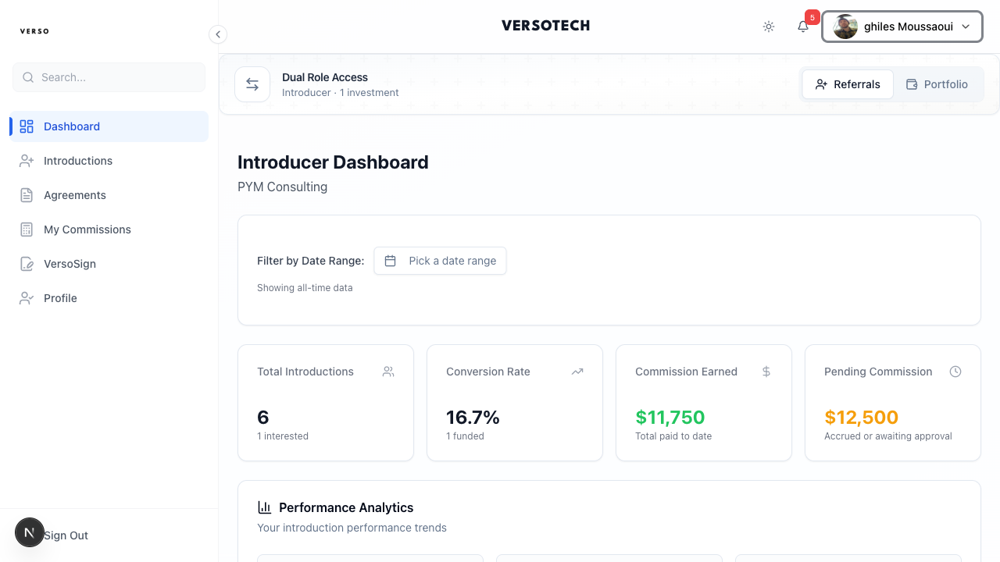
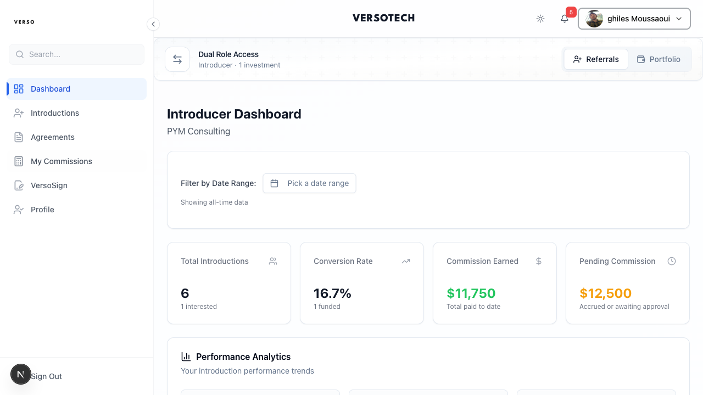

# Introducer Guide

Complete guide for introducers - from onboarding to earning and collecting commissions.


*The introducer dashboard with real commission data and dual role toggle (Referrals/Portfolio).*

---

## Your Sidebar Navigation

| Menu Item | Description |
|-----------|-------------|
| **Dashboard** | Overview and metrics |
| **Introductions** | Your referral records |
| **Agreements** | Signed agreements with arrangers |
| **My Commissions** | Commission earnings and payment tracking |
| **VersoSign** | Document signing |
| **Profile** | Your profile settings |

> **Dual Role Access**: If you also have an investor role, toggle between **Referrals** and **Portfolio** views.

---

## Your Dashboard

As an introducer, your dashboard shows:
- Active fee plans
- Pending introductions
- Commission summary (accrued, invoiced, paid)
- Recent activity

---

## 1. Getting Onboarded

### Your Profile

Complete your introducer profile:

1. **Profile** → **Edit Profile**
2. Required information:
   - Full legal name / Company name
   - Email (verified)
   - Phone number
   - Address
   - Bank details (for payments)
   - Tax information (VAT if applicable)

### KYC Requirements

Same as investor KYC - you must be verified before earning commissions.

**Individual:**
- Passport/ID
- Proof of address

**Entity:**
- Incorporation certificate
- Constitutional documents
- Member KYC for signatories

---

## 2. Signing the Introducer Agreement

Before you can earn commissions, you must sign an Introducer Agreement.

### How It Works

1. Arranger or CEO creates the agreement
2. They sign first (Party A)
3. You receive email notification
4. Click link to review and sign
5. Agreement becomes **ACTIVE**

### Multi-Signatory (If You're an Entity)

If you represent a company:
- All authorized signatories must sign
- Each receives their own signing link
- Agreement only activates when ALL have signed

### Agreement Status

| Status | Meaning |
|--------|---------|
| **Pending Signature** | Awaiting your signature |
| **Active** | Signed and in effect |
| **Expired** | Past end date |
| **Terminated** | Cancelled |

> **⚠️ REQUIREMENT:** You cannot earn commissions without an **ACTIVE** agreement.

---

## 3. Understanding Fee Plans

A **Fee Plan** defines your commission terms for a specific deal.

### Key Concept

> **Fee plans are DEAL-SPECIFIC.**
>
> Each deal has its own fee plan. There are no "master" rates - every deal is negotiated separately.

### Fee Plan Details

| Field | Meaning |
|-------|---------|
| **Deal** | Which investment opportunity |
| **Rate (bps)** | Your commission rate in basis points |
| **Fee Type** | subscription, management, performance |
| **Status** | draft, sent, accepted, rejected |

**Basis Points Conversion:**
- 100 bps = 1%
- 200 bps = 2%
- 50 bps = 0.5%

### Reviewing Fee Plans

Go to **Agreements** in the sidebar to see your agreements and fee plans.

You'll see fee plans sent to you:
- Deal name
- Rate offered
- Fee type
- Status

### Accepting or Rejecting

1. Click on the fee plan
2. Review the terms
3. Click **Accept** or **Reject**

> **⚠️ IMPORTANT:** You must ACCEPT the fee plan before the deal closes. If status is not "accepted", no commission will be created.

---

## 4. Making Introductions

An **Introduction** records that you referred a prospect to a specific deal.

### How to Record

**Introductions** → **+ Add Introduction**

| Field | Description |
|-------|-------------|
| **Prospect Name** | Who you're referring |
| **Prospect Email** | Their contact email |
| **Deal** | Which opportunity |
| **Notes** | Context about the introduction |

### Introduction Status

```
PENDING ──→ CONVERTED ──→ SUBSCRIBED
    │
    └──→ DECLINED (prospect not interested)
```

### Tracking Your Introductions

**Introductions** shows all your referrals:
- Prospect details
- Deal
- Current status
- Commission potential

---

## 5. Commission Creation

Commissions are created **automatically** when:

### Requirements (ALL Must Be Met)

| Requirement | Status Needed |
|-------------|---------------|
| Introducer Agreement | **ACTIVE** |
| Fee Plan | **ACCEPTED** |
| Investor dispatched with your fee plan | ✓ |
| Subscription | **FUNDED** |
| Deal | **CLOSED** |

### When Commissions Are Created

At deal close, the system calculates:

```
Commission = investor's funded_amount × (rate_bps / 10,000)
```

**Example:**
- Investor funded: $100,000
- Your rate: 200 bps (2%)
- Commission: $100,000 × 0.02 = $2,000

### Commission Status

Initial status: **ACCRUED**

> **Note:** Commission is based on **funded_amount** only - the actual capital the investor wired. It does NOT include management fees or other charges.

---

## 6. Commission Lifecycle

### Status Flow

```
ACCRUED ──→ INVOICE_REQUESTED ──→ INVOICE_SUBMITTED ──→ INVOICED ──→ PAID
                                         │
                                         └──→ REJECTED (resubmit)
```

### What Each Status Means

| Status | What's Happening |
|--------|------------------|
| **Accrued** | Commission calculated, you can request invoice |
| **Invoice Requested** | You initiated the invoice process |
| **Invoice Submitted** | You uploaded your invoice document |
| **Invoiced** | Arranger approved, payment pending |
| **Paid** | You've been paid |
| **Rejected** | Issue with invoice, needs correction |

---

## 7. Submitting Invoices


*The My Commissions page with real commission data showing summary cards and commission table.*

When commissions are accrued, you can submit invoices.

### Finding Accrued Commissions

Click **"My Commissions"** in the sidebar.

Use the **All Status** dropdown to filter by status or **Pick a date range** to filter by time period.

### Submitting an Invoice

1. Click on an accrued commission
2. Click **Request Invoice** or **Submit Invoice**
3. Upload your invoice document (PDF)
4. Submit

### Invoice Requirements

Your invoice must include:

| Field | Required |
|-------|----------|
| Your invoice number | ✓ |
| Invoice date | ✓ |
| Amount (must match commission) | ✓ |
| Your bank details | ✓ |
| Tax information (VAT if applicable) | ✓ |
| Description of services | ✓ |

### After Submission

- Status changes to **Invoice Submitted**
- Arranger reviews your invoice
- If approved: Status → **Invoiced** → **Paid**
- If rejected: You'll see reason, can resubmit

---

## 8. Getting Paid

### Payment Process

1. Arranger approves your invoice
2. Status: **Invoiced**
3. Finance processes payment
4. Payment made to your registered bank account
5. Status: **Paid**

### Tracking Payments

**My Commissions** → filter by **Paid**

See:
- Payment date
- Payment reference
- Amount received

### Payment Timeline

Typical timeline:
- Invoice submission → Approval: 1-5 days
- Approval → Payment: Per agreed payment terms (Net 30, etc.)

---

## 9. Commission Tracking & Reporting

### Summary View

**My Commissions** page shows four summary cards at the top:

| Card | Description |
|------|-------------|
| **Total Owed** | Commissions pending payment (green) |
| **Total Paid** | Commissions received (green) |
| **Invoice Requested** | Action needed - submit your invoice (yellow) |
| **Invoiced** | Invoices awaiting payment (blue) |

The commission table below shows columns: **Status**, **Deal**, **Arranger**, **Basis**, **Amount**, **Due Date**, **Created**, **Actions**

### By Deal

See your commissions grouped by deal:
- Which investors subscribed through you
- Commission per investor
- Total per deal

### Exporting

Click **Export** to download:
- CSV format
- Date range filter
- Status filter

---

## Viewing Your Activity

### Introductions

**Introductions** shows:
- All prospects you've referred
- Their current status
- Conversion to subscription

### Fee Plans

**Fee Plans** shows:
- All fee plans offered to you
- Status (pending acceptance, accepted)
- Commission rates

### Commissions

**My Commissions** shows:
- All earned commissions
- Status and amounts
- Invoice history

---

## Troubleshooting

### "Commission not created for my introduction"

Check ALL requirements:
1. ✓ Your Introducer Agreement is **ACTIVE**
2. ✓ The Fee Plan for this deal is **ACCEPTED**
3. ✓ The investor was dispatched with YOUR fee plan assigned
4. ✓ The investor's subscription reached **FUNDED** status
5. ✓ The deal has **CLOSED**

**Any missing = no commission.**

### "Can't submit invoice"

- Invoice submission is only enabled after deal closes
- Fee plan must have `invoice_requests_enabled`
- Check if previous invoice was rejected

### "Invoice was rejected"

Review rejection reason:
- Amount mismatch? Correct the amount
- Missing info? Add required details
- Wrong format? Check requirements

Resubmit with corrections.

### "Payment is late"

- Check agreed payment terms (Net 30, etc.)
- Contact the arranger
- Verify bank details are correct

### "I don't see the deal in my fee plans"

- Arranger may not have created fee plan yet
- Fee plan may be in draft status
- Contact the arranger

---

## Best Practices

### Onboarding
- [ ] Complete profile immediately
- [ ] Finish KYC quickly
- [ ] Sign introducer agreement promptly
- [ ] Keep bank details updated

### Fee Plans
- [ ] Review and accept fee plans quickly
- [ ] Accept BEFORE deal closes
- [ ] Keep track of which deals you have plans for

### Introductions
- [ ] Record introductions promptly
- [ ] Provide good notes/context
- [ ] Follow up with prospects

### Invoicing
- [ ] Submit invoices promptly when commissions accrue
- [ ] Use correct commission amount
- [ ] Include all required information
- [ ] Keep records of submitted invoices

---

## Key Rules Summary

| Rule | Impact |
|------|--------|
| Agreement must be ACTIVE | No commission without it |
| Fee plan must be ACCEPTED | No commission without it |
| Fee plans are deal-specific | Separate plan for each deal |
| Commission = funded_amount × rate | Not commitment, not management fees |
| Invoice amount must match | Or invoice rejected |
