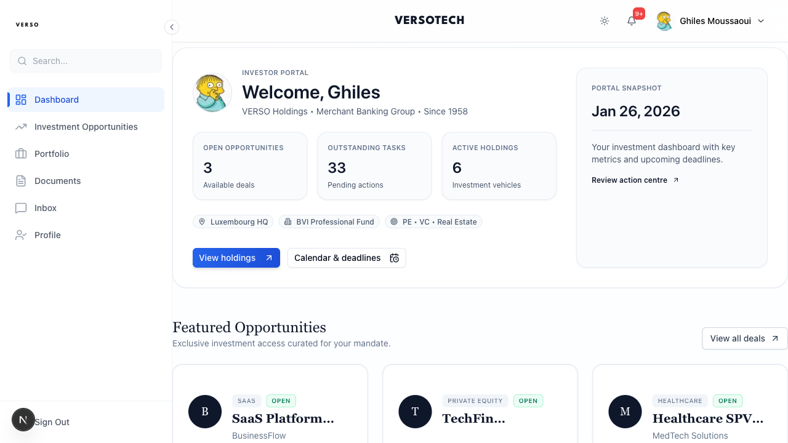
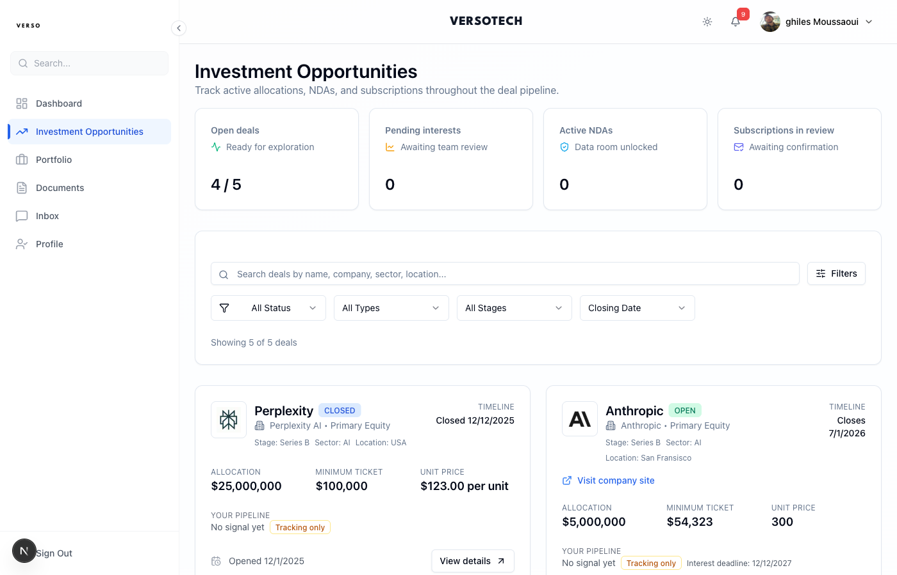

# Investor Guide

Complete guide for investors on Versotech - from profile setup to managing your portfolio.


*Your investor dashboard showing 3 open opportunities, 33 outstanding tasks, and 6 active holdings with real deal cards.*

---

## Your Sidebar Navigation

| Menu Item | Description |
|-----------|-------------|
| **Dashboard** | Overview with key metrics and featured opportunities |
| **Investment Opportunities** | Browse and filter available deals |
| **Portfolio** | View your investment positions |
| **Documents** | Access your investment documents |
| **Inbox** | Messages and notifications |
| **Profile** | Your profile and KYC settings |

---

## Your Dashboard

As an investor, your dashboard shows:
- **OPEN OPPORTUNITIES** - Available deals count
- **OUTSTANDING TASKS** - Pending actions
- **ACTIVE HOLDINGS** - Your investment vehicles
- **Featured Opportunities** - Curated deal cards

---

## 1. Profile & KYC Setup

### Complete Your Profile

**Profile** → **Edit Profile**

Required information:
- Full legal name
- Email (verified)
- Phone number
- Residential address
- Date of birth

### KYC (Know Your Customer)

You must complete KYC before investing.

**What You Need:**

| Individual | Entity |
|------------|--------|
| Passport or ID | Incorporation certificate |
| Proof of address (< 3 months) | Memorandum & Articles |
| Accreditation docs (if required) | Register of Directors |
| | Register of Members |
| | Bank confirmation letter |
| | KYC for each authorized signatory |

**How to Upload:**

1. **Profile** → **KYC**
2. Click **Upload** for each document type
3. Use high-quality scans (PDF preferred)
4. Click **Submit for Review**

**KYC Status Flow:**
```
PENDING → SUBMITTED → APPROVED
                   │
                   └→ REJECTED (resubmit corrected docs)
                   └→ EXPIRED (renewal required)
```

**Review Time:** 1-3 business days

---

## 2. Browsing Investment Opportunities


*The Investment Opportunities page with filters and deal cards.*

### Finding Deals

Click **"Investment Opportunities"** in the sidebar.

You'll see open deals with:
- Deal name and vehicle
- Target amount and progress
- Minimum investment
- Close date
- Term sheet link

### Filtering

Filter by:
- Investment size
- Deal type
- Close date
- Status

---

## 3. Expressing Interest

When you find a deal you like:

1. Click **View Details** on the deal card
2. Review the summary
3. Click **Express Interest**

**What Happens:**
- Creates approval request for CEO
- Your status: "Interest Pending"
- Wait for CEO approval

---

## 4. Signing the NDA

After CEO approves your interest:

1. You receive email with NDA signing link
2. Click link to access signing page
3. Review the NDA document
4. Apply your signature (type, draw, or upload)
5. Submit

**For Entity Investors:**
- ALL authorized signatories must sign
- Each receives their own signing email
- Document only progresses when all have signed
- Then CEO countersigns

**After NDA is Fully Signed:**
- Data room access granted (7 days)
- You can view confidential documents
- Access timer visible in platform

---

## 5. Reviewing Deal Documents

### Data Room Access

After NDA completion, you can access:
- Detailed term sheet
- Financial models
- Due diligence reports
- Legal documents
- Company presentations

### Access Expiry

- Default: 7 days from NDA signature
- If expired, click **Request Extension**
- CEO approves extension requests

### Downloading

- Documents are watermarked with your name and timestamp
- All downloads are logged

---

## 6. Subscribing to a Deal

When ready to invest:

1. Click **Subscribe** on the deal page
2. Complete the subscription form:

| Field | Description |
|-------|-------------|
| **Investment Amount** | How much you're committing |
| **Investment Entity** | Individual or your entity |
| **Source of Funds** | Where the money comes from |
| **Acknowledgments** | Risk disclosures, terms acceptance |

3. Submit subscription

**What Happens:**
- Creates approval request for CEO
- Status: "Pending"
- Wait for approval

---

## 7. Signing the Subscription Pack

After CEO approves your subscription:

1. You receive email with signing link
2. Click to access subscription pack
3. Review all documents carefully
4. Apply signature to each required page
5. Submit

**For Entity Investors:**
- All authorized signatories must sign first
- Then CEO countersigns
- Document only complete when ALL parties have signed

**After Subscription Pack Signed:**
- Status: **Committed**
- You now need to fund your investment

---

## 8. Funding Your Investment

### Wire Transfer

1. View payment instructions in platform
2. Wire from an account in YOUR name (individual) or ENTITY name
3. Use the correct reference number
4. Keep wire confirmation receipt

### Funding Status

| Status | Meaning |
|--------|---------|
| **Committed** | Signed, awaiting your wire |
| **Partially Funded** | Some funds received |
| **Funded** | Full amount received |

**Timeline:** Allow 2-5 business days for wire matching

---

## 9. Deal Close & Position Activation

When the deal closes:

**What Happens:**
- Your subscription status: **Funded** → **Active**
- A **Position** is created in the vehicle
- Your certificate is generated
- Certificate sent for Lawyer → CEO signatures
- You receive notification

**Your Position Shows:**
- Units/shares held
- Cost basis (what you invested)
- Current NAV (valuation)
- Gain/Loss

---

## 10. Viewing Your Portfolio


*Your Portfolio showing all investment positions.*

### Holdings View

Click **"Portfolio"** in the sidebar.

See all your positions across vehicles:

| Column | Description |
|--------|-------------|
| **Vehicle** | Fund name |
| **Deal** | Investment |
| **Units** | Shares you hold |
| **Cost Basis** | Your investment |
| **Current NAV** | Current value |
| **Gain/Loss** | Performance |

### Investment Documents

For each investment, access:
- Signed subscription agreement
- Certificate (when available)
- Periodic statements
- Valuation updates

---

## 11. Signing Documents

### Where to Find Pending Signatures

- **My Tasks** → **Pending Signatures**
- Email notifications with signing links

### Types of Documents

| Document | When |
|----------|------|
| **NDA** | After interest approved |
| **Subscription Pack** | After subscription approved |
| **Amendments** | If terms change |

### Multi-Signatory (Entity Investors)

If investing through an entity:
1. All authorized signatories receive signing requests
2. Each signs independently
3. Document only progresses when ALL have signed
4. Coordinate with your co-signatories for speed

---

## Status Reference

### Subscription Status Flow

```
PENDING ─────→ COMMITTED ─────→ PARTIALLY_FUNDED ─────→ FUNDED
    │              │                                        │
    │         (you signed,                              (deal closes)
    │          wire pending)                                │
    │                                                       ▼
    │                                                   ACTIVE
    │                                                  (position
    │                                                   created)
    │
    └────────→ CANCELLED
              (withdrawn/rejected)
```

### What Each Status Means For You

| Status | Your Action |
|--------|-------------|
| **Pending** | Wait for CEO approval |
| **Committed** | Wire your funds |
| **Partially Funded** | Wire remaining amount |
| **Funded** | Wait for deal close |
| **Active** | View your position |

---

## Troubleshooting

### "I expressed interest but nothing happened"

- CEO approval may be pending
- Check with your contact
- KYC may need to be completed first

### "I signed but my co-signer hasn't"

For entity investments:
- Check if all signatories received email
- Contact your co-signatories directly
- You can request resend from Tasks

### "My KYC was rejected"

- Check rejection reason in notification
- Upload corrected document
- Resubmit for review

### "I wired funds but status still shows Committed"

- Wire matching takes 2-5 business days
- Ensure correct reference was used
- Contact support with wire confirmation if >5 days

### "Deal closed but I don't see my position"

Your subscription must have been `funded` before close:
- If still `committed`, position was not created
- Contact support for resolution

### "Can't access data room"

- NDA must be fully signed (all parties)
- Check if access expired
- Request extension if needed

---

## Best Practices

### Before Investing
- [ ] Complete KYC and get approved
- [ ] Review term sheet thoroughly
- [ ] Understand the fee structure
- [ ] Verify your investment entity is set up

### During Subscription
- [ ] Double-check investment amount
- [ ] Sign documents promptly
- [ ] Coordinate with co-signatories (entity)

### Funding
- [ ] Use correct wire reference
- [ ] Wire from correct account name
- [ ] Fund well before close date
- [ ] Keep confirmation receipt

### Portfolio Management
- [ ] Check valuations periodically
- [ ] Download statements
- [ ] Keep documents for tax purposes
