# VERSO Holdings - Architecture Documentation

Welcome to the architecture documentation for the VERSO Holdings Platform. This documentation provides comprehensive technical guidance for understanding, maintaining, and extending the platform.

## Quick Links

| Document | Description |
|----------|-------------|
| [Arc42 Architecture](./arc42-architecture.md) | Complete architecture overview using Arc42 template |
| [Security Architecture](./security-architecture.md) | Security design and implementation details |
| [C4 Model](./c4-model/) | System context, container, and component diagrams |
| [Architecture Decision Records](./adr/) | Record of significant architecture decisions |
| [Diagrams](./diagrams/) | Mermaid diagrams for system visualization |

## Documentation Structure

```
docs/architecture/
├── README.md                 # This file
├── arc42-architecture.md     # Arc42 comprehensive documentation
├── security-architecture.md  # Security design document
├── c4-model/
│   ├── 01-system-context.md  # Level 1: System context
│   ├── 02-container-diagram.md # Level 2: Containers
│   └── 03-component-diagrams.md # Level 3: Components
├── adr/
│   ├── ADR-000-template.md   # ADR template
│   ├── ADR-001-supabase-baas.md
│   ├── ADR-002-dual-portal-architecture.md
│   ├── ADR-003-row-level-security.md
│   ├── ADR-004-n8n-workflow-automation.md
│   ├── ADR-005-nextjs-app-router.md
│   └── ADR-006-webhook-based-integrations.md
└── diagrams/
    ├── system-architecture.md # System diagrams (Mermaid)
    └── data-model.md          # Entity relationship diagrams
```

## Architecture Overview

### System Summary

**VERSO Holdings** is an enterprise investment management platform built with:

- **Frontend**: Next.js 15 (App Router, TypeScript, Tailwind CSS)
- **Backend**: Supabase (PostgreSQL, Auth, Storage, Realtime)
- **Automation**: n8n workflow engine
- **Deployment**: Vercel

### Key Architectural Characteristics

| Characteristic | Approach |
|---------------|----------|
| **Multi-tenancy** | Row-Level Security (RLS) for data isolation |
| **Dual-portal** | Separate investor/staff experiences, shared backend |
| **Security** | JWT auth, RLS, HMAC webhooks, audit logging |
| **Scalability** | Serverless (Vercel), managed database (Supabase) |
| **Integration** | Webhook-based with external systems |

### High-Level Architecture

```mermaid
graph TB
    Users["👤 Users"] --> Portal["🌐 Next.js<br/>Dual Portal"]
    Portal --> API["⚡ API Routes"]
    API --> DB[("🗄️ PostgreSQL<br/>+ RLS")]
    API --> Storage["📁 Storage"]
    API <--> N8N["🔄 n8n"]
    API <--> ESign["✍️ E-Sign"]
```



## Getting Started

### For New Developers

1. **Start with Arc42**: Read [arc42-architecture.md](./arc42-architecture.md) for complete system understanding
2. **Understand Security**: Review [security-architecture.md](./security-architecture.md)
3. **Check ADRs**: Browse [adr/](./adr/) for decision context

### For Specific Topics

| Topic | Start Here |
|-------|------------|
| Database schema | [diagrams/data-model.md](./diagrams/data-model.md) |
| System overview | [c4-model/01-system-context.md](./c4-model/01-system-context.md) |
| Component details | [c4-model/03-component-diagrams.md](./c4-model/03-component-diagrams.md) |
| Security controls | [security-architecture.md](./security-architecture.md) |
| Past decisions | [adr/](./adr/) |

## Architecture Decision Records (ADRs)

ADRs document significant architectural decisions:

| ADR | Title | Status |
|-----|-------|--------|
| [ADR-001](./adr/ADR-001-supabase-baas.md) | Use Supabase as Backend-as-a-Service | Accepted |
| [ADR-002](./adr/ADR-002-dual-portal-architecture.md) | Implement Dual-Portal Architecture | Accepted |
| [ADR-003](./adr/ADR-003-row-level-security.md) | Use Row-Level Security for Data Isolation | Accepted |
| [ADR-004](./adr/ADR-004-n8n-workflow-automation.md) | Integrate n8n for Workflow Automation | Accepted |
| [ADR-005](./adr/ADR-005-nextjs-app-router.md) | Use Next.js App Router Architecture | Accepted |
| [ADR-006](./adr/ADR-006-webhook-based-integrations.md) | Implement Webhook-Based Integrations | Accepted |

### Creating New ADRs

Use [ADR-000-template.md](./adr/ADR-000-template.md) for new decisions:

1. Copy the template
2. Number sequentially (ADR-007, ADR-008, etc.)
3. Fill in context, decision, and consequences
4. Submit for review with related code changes

## Diagrams

### Mermaid Diagrams

All diagrams are written in [Mermaid](https://mermaid.js.org/) for version control and easy updates:

- **Rendered automatically**: GitHub, GitBook, Docusaurus
- **VS Code**: Use Mermaid preview extension
- **Export**: Use [Mermaid Live Editor](https://mermaid.live/)

### Available Diagrams

| Diagram | File | Description |
|---------|------|-------------|
| System Overview | [system-architecture.md](./diagrams/system-architecture.md) | High-level system view |
| Dual-Portal Flow | [system-architecture.md](./diagrams/system-architecture.md) | Portal routing |
| Auth Flow | [system-architecture.md](./diagrams/system-architecture.md) | Authentication sequence |
| Data Model | [data-model.md](./diagrams/data-model.md) | Entity relationships |
| Security Layers | [system-architecture.md](./diagrams/system-architecture.md) | Security architecture |

## Updating Documentation

### When to Update

- **New features**: Add component details to C4 diagrams
- **Architecture changes**: Create new ADR, update Arc42
- **Security changes**: Update security architecture
- **Database changes**: Update data model diagrams

### Documentation Standards

1. **Use Mermaid** for all diagrams (version control friendly)
2. **Follow ADR template** for decisions
3. **Keep Arc42 current** with major changes
4. **Link related documents** for navigation

## Quality Attributes

| Attribute | Target | Measure |
|-----------|--------|---------|
| **Security** | Data isolation enforced | RLS policies, audit logs |
| **Performance** | <2s page load | Core Web Vitals |
| **Reliability** | 99.9% uptime | Monitoring, alerting |
| **Scalability** | 500+ investors | Load testing |
| **Maintainability** | Modular architecture | Code coverage, docs |

## Contact

For architecture questions or proposals:

- Create an issue in the repository
- Tag with `architecture` label
- Reference relevant ADRs

## Version History

| Version | Date | Changes |
|---------|------|---------|
| 1.0 | Dec 2025 | Initial architecture documentation |
