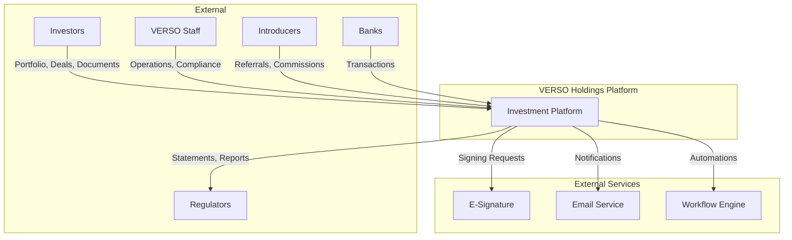
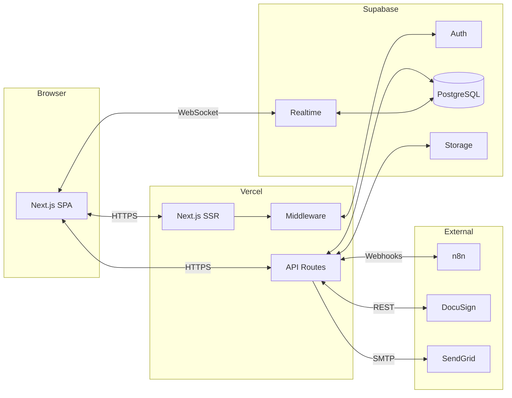
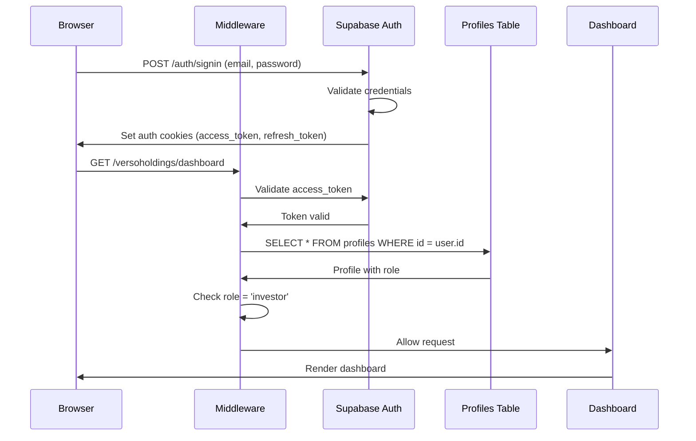
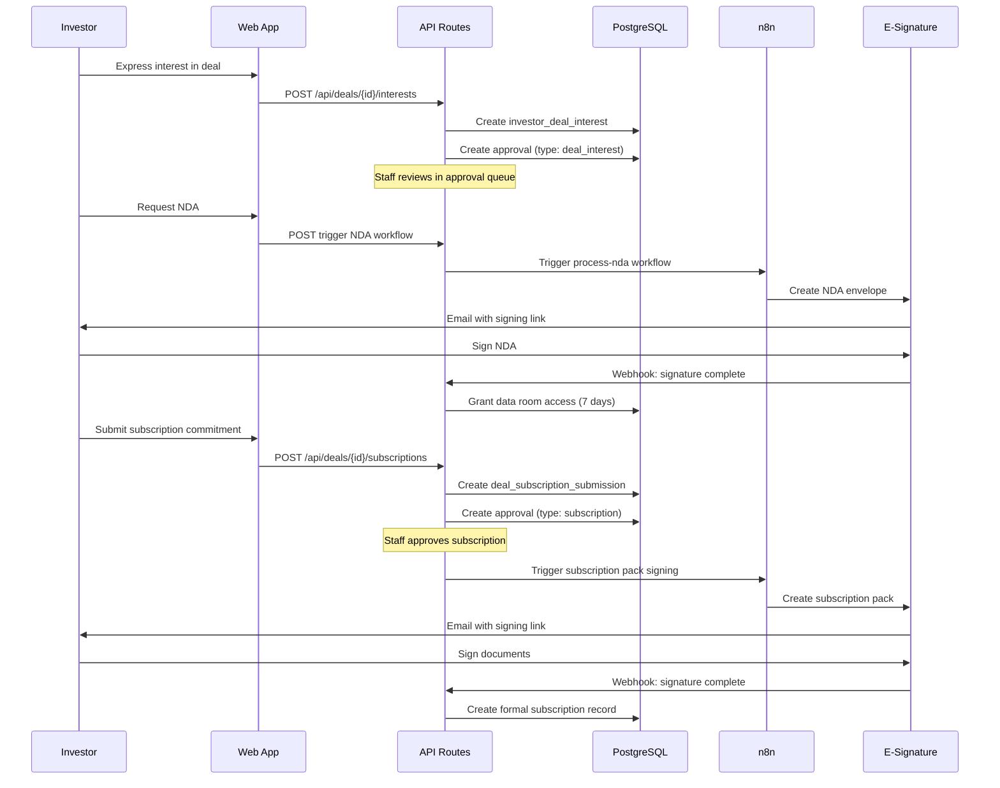
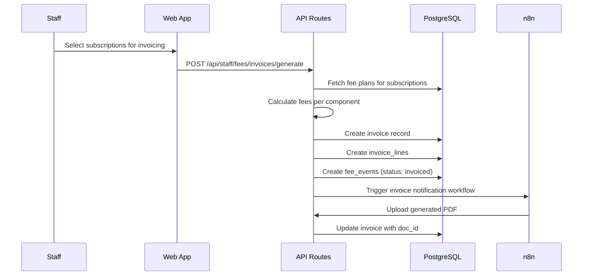

# VERSO Holdings Platform - Arc42 Architecture Documentation

**Version**: 1.0
**Date**: December 2025
**Authors**: Architecture Team

---

## Table of Contents

1. [Introduction and Goals](#1-introduction-and-goals)
2. [Constraints](#2-constraints)
3. [Context and Scope](#3-context-and-scope)
4. [Solution Strategy](#4-solution-strategy)
5. [Building Block View](#5-building-block-view)
6. [Runtime View](#6-runtime-view)
7. [Deployment View](#7-deployment-view)
8. [Crosscutting Concepts](#8-crosscutting-concepts)
9. [Architecture Decisions](#9-architecture-decisions)
10. [Quality Requirements](#10-quality-requirements)
11. [Risks and Technical Debt](#11-risks-and-technical-debt)
12. [Glossary](#12-glossary)

---

## 1. Introduction and Goals

### 1.1 Requirements Overview

VERSO Holdings is an alternative investment platform managing $800M+ in assets across private equity, venture capital, and structured investment vehicles. The platform serves as the central hub for investor relations and operational excellence.

#### Essential Features

| Feature | Description |
|---------|-------------|
| **Investor Portal** | Self-service access to portfolio data, documents, and deals |
| **Staff Operations** | Workflow automation, investor management, compliance tools |
| **Deal Management** | Investment pipeline from sourcing to closing |
| **Document Management** | Secure storage, versioning, and approval workflows |
| **Fee Accounting** | Fee plan management, invoicing, and reconciliation |
| **Compliance** | KYC/AML tracking, audit trails, regulatory reporting |

#### Business Goals

1. **Reduce operational overhead by 70%** through workflow automation
2. **24/7 investor self-service** for portfolio data and documents
3. **Sub-24-hour SLA** for investor document requests
4. **100% audit coverage** with immutable activity logs
5. **Scale from $800M to $2B+ AUM** without proportional staff increase

### 1.2 Quality Goals

| Priority | Quality Goal | Scenario |
|----------|--------------|----------|
| 1 | **Security** | Investors can only access their own data; all access is logged |
| 2 | **Reliability** | System available 99.9% during business hours |
| 3 | **Performance** | Dashboard loads in <2 seconds; API responses <500ms |
| 4 | **Maintainability** | New features can be added without architectural changes |
| 5 | **Scalability** | Support 500+ investors and 100+ concurrent users |

### 1.3 Stakeholders

| Stakeholder | Expectations |
|-------------|--------------|
| **Investors** | Intuitive portal, real-time data, secure document access |
| **Staff (Ops)** | Efficient workflows, reduced manual tasks |
| **Staff (RM)** | Complete investor view, communication tools |
| **Compliance** | Full audit trails, regulatory reporting |
| **Leadership** | Operational metrics, cost efficiency |
| **Development** | Clean architecture, testable code, clear documentation |

---

## 2. Constraints

### 2.1 Technical Constraints

| Constraint | Rationale |
|------------|-----------|
| **Next.js 15** | App Router for modern React patterns; SSR for SEO and initial load |
| **Supabase** | Unified backend (DB, Auth, Storage, Realtime); reduces operational complexity |
| **PostgreSQL** | ACID compliance for financial data; mature ecosystem |
| **TypeScript** | Type safety for financial calculations; better maintainability |
| **Row-Level Security** | Database-level data isolation; reduces application-level security bugs |

### 2.2 Organizational Constraints

| Constraint | Impact |
|------------|--------|
| **Small development team** | Favor BaaS solutions over custom infrastructure |
| **Rapid iteration** | Prefer proven libraries over custom implementations |
| **Regulatory requirements** | Must maintain audit trails; GDPR/SOC 2 considerations |
| **Multi-tenant data** | Strict data isolation between investors |

### 2.3 Conventions

| Convention | Description |
|------------|-------------|
| **Route structure** | Investor: `/versoholdings/*`, Staff: `/versotech/staff/*` |
| **Naming** | Kebab-case routes, PascalCase components, camelCase utilities |
| **API design** | RESTful, JSON payloads, Zod validation |
| **State management** | Server components for data; client components for interactivity |

---

## 3. Context and Scope

### 3.1 Business Context



#### External Interfaces

| Partner | Interface | Data Exchanged |
|---------|-----------|----------------|
| **Investors** | Web portal | Portfolio data, documents, commitments |
| **Banks** | CSV/API import | Transaction data for reconciliation |
| **E-Signature** | REST API + Webhooks | Documents for signing, signed PDFs |
| **Email Service** | SMTP/API | Transactional notifications |
| **n8n** | Webhooks (HMAC) | Workflow triggers and results |

### 3.2 Technical Context



---

## 4. Solution Strategy

### 4.1 Technology Decisions

| Decision | Rationale |
|----------|-----------|
| **Next.js App Router** | Server components reduce client bundle; better SEO; modern React patterns |
| **Supabase BaaS** | Unified backend reduces complexity; built-in RLS; real-time support |
| **shadcn/ui** | Radix primitives with Tailwind; accessible; customizable |
| **Zod validation** | Runtime type checking; TypeScript integration; API validation |
| **n8n workflows** | Visual workflow builder; self-hosted option; webhook support |

### 4.2 Architecture Approach

1. **Dual-Portal Architecture**: Separate investor and staff experiences with shared backend
2. **Database-First Security**: RLS policies enforce access control at data layer
3. **Webhook-Based Integration**: Loose coupling with external systems via HMAC-signed webhooks
4. **Progressive Enhancement**: Server components for content; client components for interactivity
5. **Audit-by-Default**: All sensitive operations logged to immutable audit trail

### 4.3 Key Design Patterns

| Pattern | Application |
|---------|-------------|
| **Repository Pattern** | Supabase clients abstract database access |
| **Strategy Pattern** | Fee calculation methods vary by fee type |
| **Observer Pattern** | Realtime subscriptions for live updates |
| **Factory Pattern** | Workflow trigger creates appropriate workflow runs |
| **Decorator Pattern** | Auth middleware decorates requests with user context |

---

## 5. Building Block View

### 5.1 Level 1: System Context

See [C4 System Context Diagram](./c4-model/01-system-context.md)

### 5.2 Level 2: Container View

```
┌─────────────────────────────────────────────────────────────────────┐
│                        VERSO Holdings Platform                       │
├─────────────────────────────────────────────────────────────────────┤
│                                                                      │
│  ┌──────────────────────────────────────────────────────────────┐  │
│  │                    Next.js Application                        │  │
│  │  ┌─────────────┐  ┌─────────────┐  ┌─────────────────────┐  │  │
│  │  │  Investor   │  │   Staff     │  │    API Routes       │  │  │
│  │  │   Portal    │  │   Portal    │  │  (/api/*)           │  │  │
│  │  └─────────────┘  └─────────────┘  └─────────────────────┘  │  │
│  │                          ↕                                    │  │
│  │  ┌─────────────────────────────────────────────────────────┐ │  │
│  │  │              Authentication Middleware                   │ │  │
│  │  └─────────────────────────────────────────────────────────┘ │  │
│  └──────────────────────────────────────────────────────────────┘  │
│                                ↕                                     │
│  ┌──────────────────────────────────────────────────────────────┐  │
│  │                      Supabase Backend                         │  │
│  │  ┌────────────┐ ┌────────────┐ ┌────────┐ ┌────────────┐    │  │
│  │  │ PostgreSQL │ │   Auth     │ │Storage │ │  Realtime  │    │  │
│  │  │  + RLS     │ │            │ │        │ │            │    │  │
│  │  └────────────┘ └────────────┘ └────────┘ └────────────┘    │  │
│  └──────────────────────────────────────────────────────────────┘  │
│                                                                      │
└─────────────────────────────────────────────────────────────────────┘
```

### 5.3 Level 3: Component View

#### Investor Portal Components

```
src/app/(investor)/versoholdings/
├── dashboard/         → Portfolio overview, NAV, activity
├── holdings/          → Vehicle positions, fees
├── deals/             → Browse opportunities
├── deal/[id]/         → Deal details, commitment
├── data-rooms/        → Data room access
├── documents/         → Document library
├── messages/          → Secure messaging
├── tasks/             → KYC, signatures
└── profile/           → Investor profile
```

#### Staff Portal Components

```
src/app/(staff)/versotech/staff/
├── dashboard/         → Operations KPIs
├── deals/             → Deal pipeline
├── investors/         → Investor database
├── entities/          → Entity management
├── approvals/         → Approval workflows
├── subscriptions/     → Subscription tracking
├── fees/              → Fee plans, invoices
├── reconciliation/    → Transaction matching
├── audit/             → Compliance, logs
└── admin/             → Staff management
```

#### Core Libraries

```
src/lib/
├── supabase/          → Client management
├── auth.ts            → Auth utilities
├── audit.ts           → Audit logging
├── trigger-workflow.ts → n8n integration
├── workflows.ts       → Workflow definitions
├── fees/              → Fee calculations
├── signature/         → E-sign integration
├── messaging/         → Messaging utilities
└── documents/         → Document access
```

---

## 6. Runtime View

### 6.1 Investor Login Flow



### 6.2 Deal Subscription Flow



### 6.3 Fee Invoice Generation



---

## 7. Deployment View

### 7.1 Infrastructure Overview

```
┌─────────────────────────────────────────────────────────────────────┐
│                           Internet                                   │
└─────────────────────────────────────────────────────────────────────┘
                                   │
                    ┌──────────────┴──────────────┐
                    │      Vercel Edge Network     │
                    │   (CDN, SSL, DDoS Protection)│
                    └──────────────┬──────────────┘
                                   │
┌─────────────────────────────────────────────────────────────────────┐
│                        Vercel Platform                               │
│  ┌───────────────────────────────────────────────────────────────┐ │
│  │                   Serverless Functions                         │ │
│  │  ┌─────────────┐  ┌─────────────┐  ┌─────────────────────┐   │ │
│  │  │   Pages     │  │ API Routes  │  │    Middleware       │   │ │
│  │  │  (SSR/SSG)  │  │  (Lambda)   │  │  (Edge Runtime)     │   │ │
│  │  └─────────────┘  └─────────────┘  └─────────────────────┘   │ │
│  └───────────────────────────────────────────────────────────────┘ │
└─────────────────────────────────────────────────────────────────────┘
                                   │
                    ┌──────────────┴──────────────┐
                    │     Supabase Cloud           │
                    │   (AWS us-east-1)            │
                    │  ┌─────────────────────────┐│
                    │  │ PostgreSQL (RDS)        ││
                    │  │ + Row-Level Security    ││
                    │  ├─────────────────────────┤│
                    │  │ Auth (GoTrue)           ││
                    │  ├─────────────────────────┤│
                    │  │ Storage (S3)            ││
                    │  ├─────────────────────────┤│
                    │  │ Realtime (Elixir)       ││
                    │  └─────────────────────────┘│
                    └─────────────────────────────┘
                                   │
                    ┌──────────────┴──────────────┐
                    │     External Services        │
                    │  ┌──────────┐ ┌──────────┐  │
                    │  │   n8n    │ │ DocuSign │  │
                    │  │ (Docker) │ │ (Cloud)  │  │
                    │  └──────────┘ └──────────┘  │
                    └─────────────────────────────┘
```

### 7.2 Environment Configuration

| Environment | URL | Database | Purpose |
|-------------|-----|----------|---------|
| **Development** | localhost:3000 | Supabase Cloud | Local development |
| **Preview** | *.vercel.app | Supabase Branch | PR previews |
| **Production** | app.versoholdings.com | Supabase Production | Live system |

### 7.3 Environment Variables

```bash
# Supabase
NEXT_PUBLIC_SUPABASE_URL=https://xxx.supabase.co
NEXT_PUBLIC_SUPABASE_ANON_KEY=eyJ...
SUPABASE_SERVICE_ROLE_KEY=eyJ...

# n8n Integration
N8N_OUTBOUND_SECRET=hmac-secret-for-outbound
N8N_INBOUND_SECRET=hmac-secret-for-inbound

# E-Signature
ESIGN_API_KEY=xxx
ESIGN_WEBHOOK_SECRET=xxx

# Storage
STORAGE_BUCKET_NAME=documents
DEAL_DOCUMENTS_BUCKET=deal-documents

# Application
NEXT_PUBLIC_APP_URL=https://app.versoholdings.com
NODE_ENV=production
```

---

## 8. Crosscutting Concepts

### 8.1 Security

#### Authentication
- **Method**: JWT tokens via Supabase Auth
- **Token Lifetime**: Access token 1 hour, refresh token 30 days
- **MFA**: Optional for investors, recommended for staff
- **Session**: HTTP-only cookies, automatic refresh

#### Authorization
- **Model**: Role-based access control (RBAC)
- **Enforcement**: Database RLS + middleware checks
- **Roles**: `investor`, `staff_admin`, `staff_ops`, `staff_rm`

#### Data Protection
- **Encryption at Rest**: Supabase encrypts all data
- **Encryption in Transit**: TLS 1.3 for all connections
- **PII Handling**: Minimal collection, encrypted storage

### 8.2 Audit Logging

```typescript
interface AuditLog {
  id: uuid;
  actor_id: uuid;          // Who performed the action
  event_type: string;      // 'create' | 'update' | 'delete' | 'access'
  entity_type: string;     // 'investor' | 'document' | 'deal' | etc.
  entity_id: uuid;         // What was affected
  changes: jsonb;          // Before/after for updates
  metadata: jsonb;         // Additional context
  ip_address: text;        // Request origin
  created_at: timestamptz; // When it happened
}
```

**Logged Events**:
- All authentication events (login, logout, password change)
- Data access (document downloads, portfolio views)
- Data modifications (investor updates, subscription changes)
- Approval actions (approve, reject, escalate)
- Workflow triggers and completions

### 8.3 Error Handling

```typescript
// Standard API error response
interface APIError {
  error: string;           // Error code
  message: string;         // Human-readable message
  details?: unknown;       // Additional context (development only)
}

// HTTP status codes
// 400 - Bad Request (validation errors)
// 401 - Unauthorized (missing/invalid auth)
// 403 - Forbidden (insufficient permissions)
// 404 - Not Found
// 422 - Unprocessable Entity (business logic errors)
// 500 - Internal Server Error
```

### 8.4 Caching

| Level | Strategy | TTL |
|-------|----------|-----|
| **Browser** | React Query / SWR patterns | Variable |
| **Dashboard** | Server-side cache | 5 minutes |
| **Static Assets** | Vercel CDN | 1 year (immutable) |
| **API Responses** | Cache-Control headers | Variable |

### 8.5 Internationalization

Currently English-only, but structured for future i18n:
- Date formats: ISO 8601 internally, localized for display
- Currency: Multi-currency support (USD, EUR, GBP, etc.)
- Numbers: Locale-aware formatting

---

## 9. Architecture Decisions

See [Architecture Decision Records](./adr/) for detailed decision documentation.

### Key Decisions

| ID | Decision | Status |
|----|----------|--------|
| ADR-001 | Use Supabase as Backend-as-a-Service | Accepted |
| ADR-002 | Implement dual-portal architecture | Accepted |
| ADR-003 | Use Row-Level Security for data isolation | Accepted |
| ADR-004 | Integrate n8n for workflow automation | Accepted |
| ADR-005 | Use Next.js App Router | Accepted |
| ADR-006 | Implement webhook-based integrations | Accepted |

---

## 10. Quality Requirements

### 10.1 Quality Tree

```
Quality
├── Security
│   ├── Data Isolation (RLS)
│   ├── Authentication (JWT + MFA)
│   └── Audit Trails
├── Reliability
│   ├── 99.9% Availability
│   ├── Data Durability
│   └── Graceful Degradation
├── Performance
│   ├── <2s Page Load
│   ├── <500ms API Response
│   └── <100ms Realtime Updates
├── Maintainability
│   ├── Modular Architecture
│   ├── Comprehensive Testing
│   └── Documentation
└── Scalability
    ├── 500+ Investors
    ├── 100+ Concurrent Users
    └── $2B+ AUM
```

### 10.2 Quality Scenarios

| ID | Quality | Scenario | Measure |
|----|---------|----------|---------|
| Q1 | Security | Investor attempts to access another investor's data | Request blocked by RLS, access attempt logged |
| Q2 | Performance | Staff dashboard loads during peak hours | Dashboard loads in <2 seconds |
| Q3 | Reliability | Supabase experiences temporary outage | System shows cached data, queues writes |
| Q4 | Scalability | New investor onboarded | No performance degradation |
| Q5 | Maintainability | New fee type added | Implementation in <2 days |

---

## 11. Risks and Technical Debt

### 11.1 Known Risks

| Risk | Probability | Impact | Mitigation |
|------|-------------|--------|------------|
| Supabase service disruption | Low | High | Multi-region backup, documented failover |
| n8n workflow failures | Medium | Medium | Retry logic, manual fallback procedures |
| Token refresh race conditions | Low | Medium | Singleton client, exponential backoff |
| Large file uploads failing | Medium | Low | Chunked uploads, progress indicators |

### 11.2 Technical Debt

| Item | Severity | Effort to Fix | Plan |
|------|----------|---------------|------|
| Some components exceed 500 lines | Medium | Medium | Refactor during feature work |
| Inconsistent error handling | Low | Low | Standardize in next release |
| Test coverage gaps | Medium | High | Incremental improvement |
| Some RLS policies missing | High | Low | Add during security audit |
| Magic strings in some places | Low | Low | Extract to constants |

### 11.3 Monitoring and Alerting

| Metric | Threshold | Action |
|--------|-----------|--------|
| API Error Rate | >1% | Page on-call |
| Response Time (p95) | >2s | Alert team |
| Database Connection Pool | >80% | Scale up |
| Storage Usage | >80% | Plan expansion |

---

## 12. Glossary

| Term | Definition |
|------|------------|
| **AUM** | Assets Under Management - total value of investments |
| **Capital Call** | Request for investors to contribute committed capital |
| **Distribution** | Return of capital or profits to investors |
| **HNW** | High Net Worth individual |
| **KYC** | Know Your Customer - identity verification process |
| **NAV** | Net Asset Value - current value of investment |
| **NDA** | Non-Disclosure Agreement |
| **RLS** | Row-Level Security - database access control |
| **RM** | Relationship Manager - staff assigned to investors |
| **SPV** | Special Purpose Vehicle - single-deal investment entity |
| **Subscription** | Investor's commitment to invest in a vehicle |
| **Vehicle** | Investment structure (fund, SPV, note) |

---

## References

- [C4 Model Diagrams](./c4-model/)
- [Architecture Decision Records](./adr/)
- [Database Schema](../DATABASE_SCHEMA.md)
- [API Documentation](../api/)
- [Security Guidelines](./security-architecture.md)
