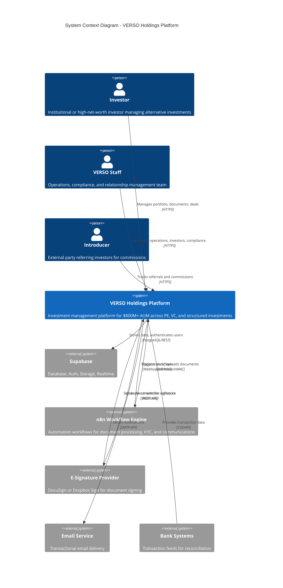

# C4 Model: Level 1 - System Context Diagram

## Overview

This document describes the highest level of abstraction for the VERSO Holdings Platform, showing how the system fits into its environment and interacts with users and external systems.

## System Context Diagram



## Actors

### Primary Users

| Actor | Description | Key Needs |
|-------|-------------|-----------|
| **Investor** | Institutional or HNW investor with capital in VERSO vehicles | Portfolio visibility, document access, deal participation, communication |
| **Staff Admin** | Senior operations personnel with full system access | User management, approvals, compliance oversight, reporting |
| **Staff Ops** | Day-to-day operations team members | Deal management, investor requests, document processing |
| **Staff RM** | Relationship managers assigned to investors | KYC management, investor communication, deal coordination |
| **Introducer** | External referral partners earning commissions | Track introductions, view commission status |

### External Systems

| System | Purpose | Integration Type |
|--------|---------|------------------|
| **Supabase** | Backend-as-a-Service (PostgreSQL, Auth, Storage, Realtime) | Direct database, REST API, WebSocket |
| **n8n** | Workflow automation engine for complex business processes | Bidirectional webhooks with HMAC signing |
| **DocuSign/Dropbox Sign** | Electronic signature for legal documents | REST API + webhooks |
| **Email Provider** | Transactional email delivery (SendGrid/Postmark) | SMTP or REST API |
| **Bank Systems** | Transaction data for payment reconciliation | CSV imports, API feeds |

## System Boundaries

### What's Inside

- **Investor Portal** (`/versoholdings/*`): Self-service investor experience
- **Staff Portal** (`/versotech/staff/*`): Operations management interface
- **API Layer**: RESTful endpoints for all business operations
- **Real-time Engine**: Live updates for messaging, notifications, and dashboards
- **Document Management**: Upload, versioning, approval workflows, and storage

### What's Outside

- **Payment Processing**: Bank transfers handled externally, reconciled in-system
- **Fund Administration**: NAV calculations may involve external fund admin
- **Regulatory Filings**: SEC/regulatory submissions handled separately
- **Marketing Website**: Separate from operational platform

## Key Data Flows

### 1. Investor Onboarding Flow
```
Investor → Platform → KYC Documents → Staff Review → Supabase → Approval → n8n → Welcome Email
```

### 2. Deal Subscription Flow
```
Staff → Create Deal → Investors → Express Interest → NDA (DocuSign) → Data Room Access → Submit Commitment → Staff Approval → Subscription Pack Signing → Formal Subscription
```

### 3. Document Distribution Flow
```
Staff → Upload Document → Approval Workflow → Publish → n8n → Email Notification → Investor Download
```

### 4. Fee Billing Flow
```
Staff → Configure Fee Plan → Generate Invoice → Send to Investor → Payment Received → Bank Transaction → Reconciliation Match
```

## Security Boundaries

### Trust Levels

1. **Unauthenticated**: Public login pages only
2. **Authenticated Investor**: Own portfolio, documents, messages
3. **Authenticated Staff**: Operations based on role
4. **Service Role**: Administrative operations (background jobs, migrations)
5. **External Systems**: HMAC-verified webhooks only

### Authentication Flow
```
User → Login → Supabase Auth → JWT Token → Middleware Validation → Profile Lookup → Role-Based Access
```

## Scalability Considerations

| Metric | Current | Target |
|--------|---------|--------|
| Investors | 50+ | 500+ |
| AUM | $800M | $2B+ |
| Documents | Thousands | Hundreds of thousands |
| Concurrent Users | ~20 | ~200 |

## Related Documentation

- [Level 2: Container Diagram](./02-container-diagram.md)
- [Level 3: Component Diagrams](./03-component-diagrams.md)
- [Security Architecture](../security-architecture.md)
