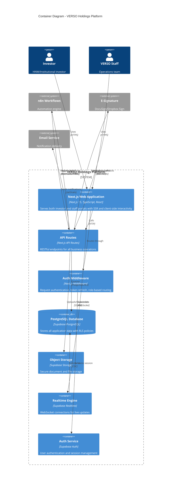

# C4 Model: Level 2 - Container Diagram

## Overview

This document describes the high-level shape of the VERSO Holdings Platform architecture and how responsibilities are distributed across containers (deployable units).

## Container Diagram



## Containers

### 1. Next.js Web Application

**Technology**: Next.js 15, TypeScript, React 18, Tailwind CSS, shadcn/ui

**Responsibilities**:
- Server-side rendering for initial page loads and SEO
- Client-side interactivity for complex forms and dashboards
- Dual-portal routing (investor: `/versoholdings/*`, staff: `/versotech/staff/*`)
- Real-time UI updates via Supabase subscriptions

**Key Directories**:
```
src/app/
├── (public)/          # Login pages, public routes
├── (investor)/        # Investor portal routes
│   └── versoholdings/
├── (staff)/           # Staff portal routes
│   └── versotech/staff/
├── api/               # API route handlers
└── layout.tsx         # Root layout
```

**Deployment**: Vercel (serverless)

---

### 2. API Routes

**Technology**: Next.js API Routes, TypeScript

**Responsibilities**:
- RESTful CRUD operations for all entities
- Authentication and authorization enforcement
- Input validation (Zod schemas)
- Audit logging for sensitive operations
- Webhook handlers for external integrations

**Key Route Categories**:
| Category | Base Path | Endpoints |
|----------|-----------|-----------|
| Authentication | `/api/auth/*` | signin, signup, logout, password |
| Deals | `/api/deals/*` | CRUD, commitments, documents, access |
| Investors | `/api/investors/*` | subscriptions, entities, documents |
| Staff Operations | `/api/staff/*` | fees, invoices, reconciliation |
| Approvals | `/api/approvals/*` | list, action, history |
| Documents | `/api/documents/*` | upload, download, folders |
| Messaging | `/api/conversations/*` | threads, messages |
| Workflows | `/api/admin/workflows/*` | triggers, status |
| Cron Jobs | `/api/cron/*` | scheduled tasks |

---

### 3. Authentication Middleware

**Technology**: Next.js Middleware

**Responsibilities**:
- Session validation on every request
- Automatic token refresh with exponential backoff
- Role-based route protection
- Portal boundary enforcement (investors can't access staff routes)

**Processing Flow**:
```
Request → Check Session → Validate Token → Refresh if Needed → Fetch Profile → Check Role → Allow/Redirect
```

---

### 4. PostgreSQL Database (Supabase)

**Technology**: PostgreSQL 15 via Supabase

**Responsibilities**:
- Primary data storage for all entities
- Row-Level Security (RLS) for data isolation
- Triggers and functions for business logic
- Full-text search capabilities

**Core Tables** (48 total):
| Category | Tables |
|----------|--------|
| Identity | `profiles`, `investors`, `investor_users` |
| Investments | `vehicles`, `deals`, `subscriptions`, `positions` |
| Fees | `fee_plans`, `fee_components`, `invoices`, `payments` |
| Documents | `documents`, `document_versions`, `document_folders` |
| Approvals | `approvals`, `approval_history` |
| Messaging | `conversations`, `messages`, `message_reads` |
| Audit | `audit_logs`, `compliance_alerts` |

---

### 5. Object Storage (Supabase Storage)

**Technology**: S3-compatible object storage

**Responsibilities**:
- Secure document storage with access policies
- Signed URLs for time-limited downloads
- PDF watermarking and versioning
- Data room document management

**Buckets**:
| Bucket | Purpose | Access |
|--------|---------|--------|
| `documents` | Investor documents (K-1s, statements) | RLS-protected |
| `deal-documents` | Deal data room files | Access-controlled |
| `public` | Logos, static assets | Public read |

---

### 6. Realtime Engine (Supabase Realtime)

**Technology**: WebSocket with CDC (Change Data Capture)

**Responsibilities**:
- Live message updates in conversations
- Real-time dashboard metrics
- Notification delivery
- Approval status changes

**Subscribed Channels**:
- `conversations:*` - Message updates
- `approvals:*` - Status changes
- `notifications:*` - User alerts
- `deals:*` - Deal status updates

---

### 7. Auth Service (Supabase Auth)

**Technology**: Supabase Auth (JWT-based)

**Responsibilities**:
- User registration and login
- Password reset flows
- Session management (JWT tokens)
- Multi-factor authentication (optional)
- OAuth providers (if configured)

**Token Flow**:
```
Login → Supabase Auth → Access Token (1hr) + Refresh Token → Middleware Refresh → New Access Token
```

## External Integrations

### n8n Workflow Engine

**Purpose**: Complex business process automation

**Integration Pattern**: Bidirectional webhooks with HMAC-SHA256 signing

**Workflows**:
1. Position Statement Generator
2. NDA Processing Agent
3. Inbox Manager
4. KYC/AML Processing
5. Capital Call Processing
6. Reporting Agent
7. Investor Onboarding
8. LinkedIn Leads Scraper

### E-Signature Provider

**Purpose**: Legally binding document signatures

**Integration Pattern**: REST API for sending, webhooks for completion

**Supported Providers**: DocuSign, Dropbox Sign

**Flow**:
```
Generate Document → Create Envelope → Send for Signature → Webhook on Complete → Store Signed PDF
```

### Email Service

**Purpose**: Transactional notifications

**Use Cases**:
- Welcome emails
- Document availability notifications
- Capital call notices
- KYC reminders
- Password reset

## Data Flow Patterns

### 1. Read-Heavy Dashboard Pattern
```
Client → API Route → Supabase (RLS) → Cached Response → Client Render
           ↓
      Dashboard Cache (5-min TTL)
```

### 2. Write-with-Audit Pattern
```
Client → API Route → Validate → Write to DB → Audit Log → Response
                        ↓
                   Trigger (if applicable)
```

### 3. Real-time Subscription Pattern
```
Client → WebSocket Connect → Channel Subscribe → DB Change → Broadcast → Client Update
```

### 4. Workflow Trigger Pattern
```
API Route → Generate HMAC → POST to n8n → Create Workflow Run → Poll for Status
                                ↓
                        n8n Webhook Return → Update Workflow Run → Notify
```

## Deployment Architecture

```
┌─────────────────────────────────────────────────────────────┐
│                         Vercel                               │
│  ┌─────────────────────────────────────────────────────┐   │
│  │              Next.js Application                     │   │
│  │  ┌───────────┐  ┌───────────┐  ┌────────────────┐  │   │
│  │  │   Pages   │  │ API Routes│  │   Middleware   │  │   │
│  │  └───────────┘  └───────────┘  └────────────────┘  │   │
│  └─────────────────────────────────────────────────────┘   │
│                            │                                 │
└────────────────────────────│─────────────────────────────────┘
                             │
                    ┌────────┴────────┐
                    │   Supabase      │
                    │  ┌───────────┐  │
                    │  │ PostgreSQL│  │
                    │  ├───────────┤  │
                    │  │  Storage  │  │
                    │  ├───────────┤  │
                    │  │   Auth    │  │
                    │  ├───────────┤  │
                    │  │ Realtime  │  │
                    │  └───────────┘  │
                    └─────────────────┘
```

## Security Considerations

### Container-Level Security

| Container | Security Measures |
|-----------|------------------|
| Web App | HTTPS-only, CSP headers, CORS |
| API Routes | Auth required, rate limiting, input validation |
| Database | RLS policies, encrypted at rest, connection pooling |
| Storage | Signed URLs, access policies, encryption |
| Auth | JWT with short TTL, refresh rotation, MFA support |

### Inter-Container Communication

- All traffic encrypted (TLS 1.3)
- Service role key never exposed to client
- Webhook signatures verified (HMAC-SHA256)
- Audit logging on all sensitive operations

## Related Documentation

- [Level 1: System Context](./01-system-context.md)
- [Level 3: Component Diagrams](./03-component-diagrams.md)
- [Database Schema](../DATABASE_SCHEMA.md)
