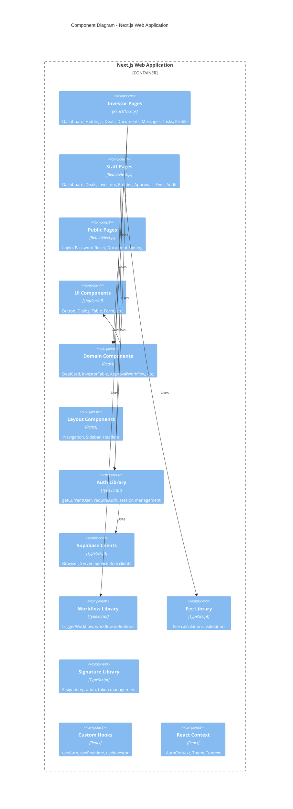
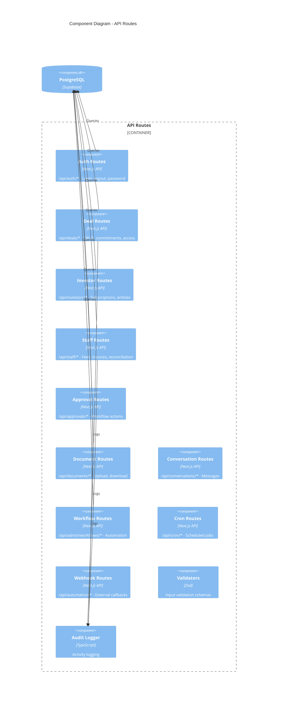
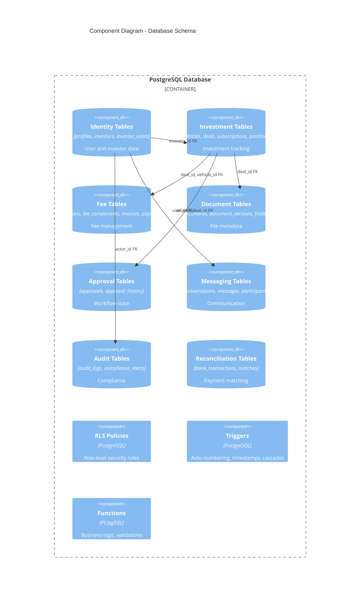
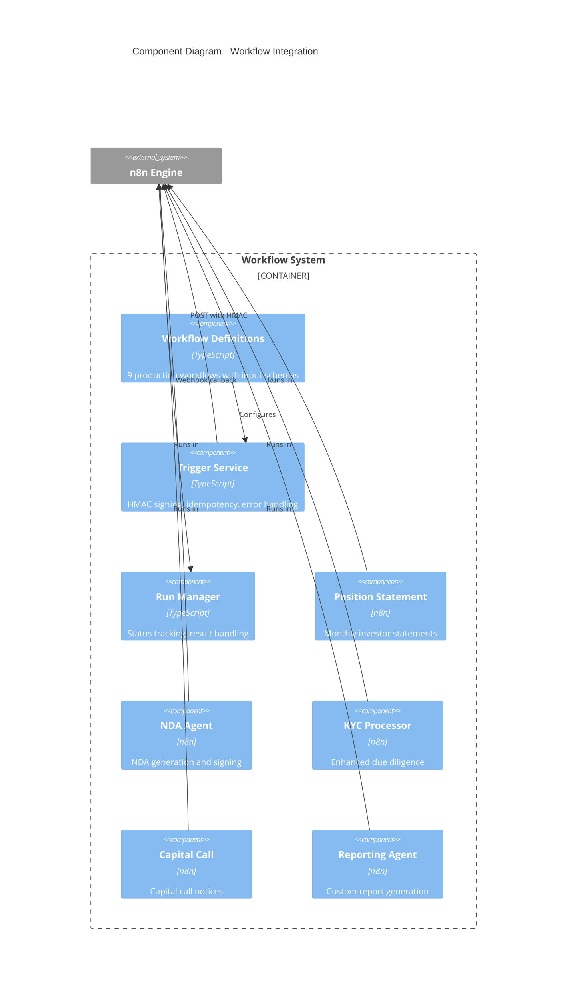
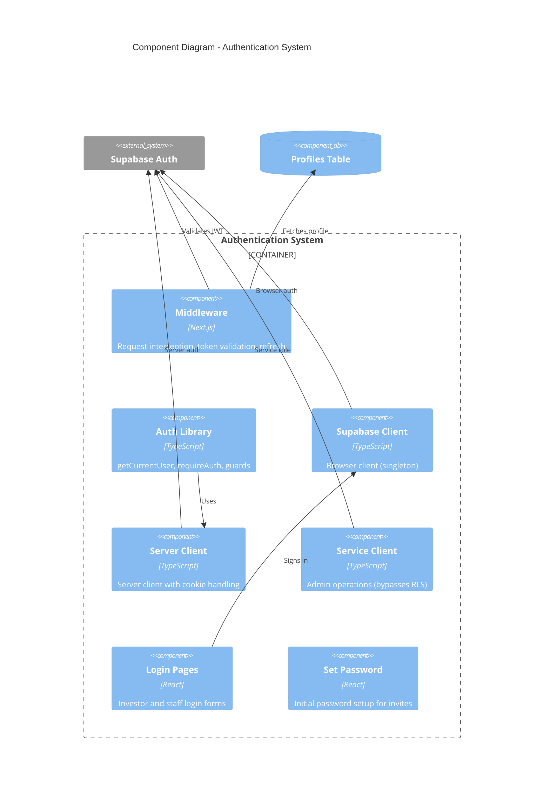
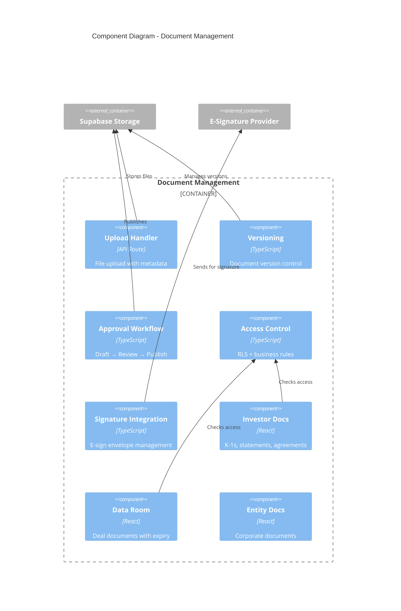

# C4 Model: Level 3 - Component Diagrams

## Overview

This document describes the internal structure of key containers, showing how they are composed of components and their responsibilities.

## 1. Next.js Web Application Components



### Investor Portal Pages (`src/app/(investor)/versoholdings/`)

| Page | Component | Lines | Responsibility |
|------|-----------|-------|----------------|
| `/dashboard` | InvestorDashboard | 825 | Portfolio overview, NAV, recent activity |
| `/holdings` | HoldingsPage | 162 | Vehicle positions with fees |
| `/deals` | DealsPage | 384 | Browse investment opportunities |
| `/deal/[id]` | DealDetail | 769 | Deal info, term sheet, commitment |
| `/data-rooms` | DataRoomsPage | 204 | Data room access list |
| `/data-rooms/[dealId]` | DataRoomExplorer | 428 | File browser with expiration |
| `/documents` | DocumentsPage | 7 | Document library |
| `/messages` | MessagesPage | 89 | Secure messaging |
| `/tasks` | TasksPage | 156 | KYC, signatures, capital calls |
| `/profile` | ProfilePage | 81 | Investor profile and entities |

### Staff Portal Pages (`src/app/(staff)/versotech/staff/`)

| Page | Component | Lines | Responsibility |
|------|-----------|-------|----------------|
| `/dashboard` | StaffDashboard | 567 | Operations overview, KPIs |
| `/deals` | DealsPage | 350 | Deal pipeline management |
| `/deals/[id]` | DealDetailClient | 800+ | Complete deal management |
| `/investors` | InvestorsPage | 521 | Investor database |
| `/investors/[id]` | InvestorDetail | 338 | Investor profile and KYC |
| `/entities` | EntitiesPage | 200 | Entity management |
| `/entities/[id]` | EntityDetailEnhanced | 2,779 | Full entity management (largest) |
| `/approvals` | ApprovalsPageClient | 949 | Approval workflows |
| `/subscriptions` | SubscriptionsPage | 300 | Subscription management |
| `/fees` | FeesPage | 400 | Fee plans and invoicing |
| `/reconciliation` | ReconciliationPage | 350 | Transaction matching |
| `/audit` | AuditPage | 300 | Compliance and audit logs |
| `/kyc-review` | KycReviewClient | 842 | KYC questionnaire review |

### Core Libraries (`src/lib/`)

| Library | File(s) | Responsibility |
|---------|---------|----------------|
| `auth` | `auth.ts` | User authentication utilities |
| `supabase` | `client.ts`, `server.ts` | Database client management |
| `workflows` | `workflows.ts`, `trigger-workflow.ts` | n8n workflow integration |
| `fees` | `calculations.ts`, `validation.ts` | Fee computation and validation |
| `signature` | `client.ts`, `handlers.ts`, `token.ts` | E-signature integration |
| `audit` | `audit.ts` | Audit logging infrastructure |
| `messaging` | `index.ts`, `supabase.ts` | Messaging utilities |
| `documents` | `investor-documents.ts` | Document access control |

---

## 2. API Routes Component Diagram



### API Route Categories

#### Authentication (`/api/auth/*`)
```
POST /api/auth/signin       - Email/password login
POST /api/auth/signup       - New investor registration
POST /api/auth/logout       - Session termination
PUT  /api/auth/password     - Password change
POST /api/auth/create-profile - Profile creation
GET  /api/auth/me           - Current user info
```

#### Deal Management (`/api/deals/*`)
```
GET    /api/deals                          - List deals (filtered)
POST   /api/deals                          - Create deal
GET    /api/deals/[id]                     - Deal details
PATCH  /api/deals/[id]                     - Update deal
POST   /api/deals/[id]/commitments         - Submit commitment
POST   /api/deals/[id]/commitments/[cid]/approve - Approve commitment
GET    /api/deals/[id]/documents           - List data room docs
GET    /api/deals/[id]/documents/[did]/download - Download document
POST   /api/deals/[id]/folders             - Manage folders
POST   /api/deals/[id]/interests           - Track interest
```

#### Staff Operations (`/api/staff/*`)
```
GET  /api/staff/fees/plans          - List fee plans
POST /api/staff/fees/plans          - Create fee plan
GET  /api/staff/fees/invoices       - List invoices
POST /api/staff/fees/invoices/generate - Generate invoice
POST /api/staff/fees/commissions    - Track commissions
GET  /api/staff/fees/dashboard      - Fee overview
GET  /api/staff/available           - Available staff
```

#### Cron Jobs (`/api/cron/*`)
```
GET /api/cron/data-room-expiry        - Expire old access
GET /api/cron/publish-documents       - Auto-publish docs
GET /api/cron/fees/generate-scheduled - Recurring fees
GET /api/cron/auto-match-reconciliation - AI matching
```

---

## 3. Database Component Diagram



### Core Entity Groups

#### Identity & Access
| Table | Records | Purpose |
|-------|---------|---------|
| `profiles` | 7 | User accounts (linked to auth.users) |
| `investors` | 386 | Investor entities with KYC |
| `investor_users` | 2 | User-to-investor mapping |

#### Investment Management
| Table | Records | Purpose |
|-------|---------|---------|
| `vehicles` | 91 | Investment vehicles (funds, SPVs) |
| `deals` | 14 | Investment opportunities |
| `subscriptions` | 629 | Investor commitments |
| `positions` | 10 | NAV and cost basis |

#### Fee Accounting
| Table | Records | Purpose |
|-------|---------|---------|
| `fee_plans` | 14 | Fee structure definitions |
| `fee_components` | 28 | Individual fee line items |
| `invoices` | - | Fee billing |
| `payments` | - | Payment receipts |

#### Workflow & Approval
| Table | Records | Purpose |
|-------|---------|---------|
| `approvals` | 66 | Pending/completed approvals |
| `workflows` | 16 | Workflow definitions |
| `workflow_runs` | 45 | Execution history |

---

## 4. Workflow Integration Component Diagram



### Production Workflows

| Key | Category | Purpose | Trigger |
|-----|----------|---------|---------|
| `generate-position-statement` | documents | Monthly investor statements | Manual/Scheduled |
| `process-nda` | compliance | NDA generation and DocuSign | Manual |
| `inbox-manager` | communications | Email categorization and routing | Scheduled |
| `kyc-aml-processing` | compliance | Enhanced due diligence | Scheduled |
| `capital-call-processing` | multi_step | Capital call notices | Scheduled |
| `reporting-agent` | data_processing | Custom report generation | Manual |
| `investor-onboarding` | multi_step | Multi-step onboarding | Scheduled |
| `linkedin-leads-scraper` | data_processing | Prospect identification | Scheduled |
| `shared-drive-notification` | communications | Document update alerts | Scheduled |

### Workflow Input Schema Types

```typescript
type WorkflowFieldType =
  | 'text'           // Free text input
  | 'email'          // Email validation
  | 'number'         // Numeric input
  | 'date'           // Date picker
  | 'datetime'       // Date and time
  | 'select'         // Dropdown options
  | 'checkbox'       // Boolean toggle
  | 'investor_select' // Dynamic investor lookup
  | 'vehicle_select'  // Dynamic vehicle lookup
  | 'conversation_select'; // Dynamic conversation lookup
```

---

## 5. Authentication Component Diagram



### Authentication Flow

```
1. User submits credentials
   ↓
2. Supabase Auth validates
   ↓
3. Returns access_token (1hr) + refresh_token
   ↓
4. Stored in HTTP-only cookies
   ↓
5. Middleware validates on each request
   ↓
6. Auto-refresh if expiring (with retry)
   ↓
7. Profile fetched for role-based access
   ↓
8. Route allowed/denied based on role
```

### User Roles

| Role | Portal Access | Permissions |
|------|--------------|-------------|
| `investor` | `/versoholdings/*` | Own portfolio, documents, messages |
| `staff_admin` | `/versotech/staff/*` | Full access, user management |
| `staff_ops` | `/versotech/staff/*` | Operations, deals, documents |
| `staff_rm` | `/versotech/staff/*` | Investor relations, KYC |

---

## 6. Document Management Component Diagram



### Document Lifecycle

```
1. Upload (draft)
   ↓
2. Metadata entry
   ↓
3. Request approval (pending_approval)
   ↓
4. Review by staff
   ↓
5. Approve/Reject
   ↓
6. Publish (visible to investors)
   ↓
7. Archive (if needed)
```

### Document Types

| Type | Purpose | Storage Bucket |
|------|---------|----------------|
| K-1 | Tax documents | `documents` |
| Statement | Quarterly/annual reports | `documents` |
| Agreement | Subscription agreements | `documents` |
| NDA | Non-disclosure agreements | `documents` |
| Data Room | Deal due diligence | `deal-documents` |
| Entity | Corporate documents | `documents` |

---

## Related Documentation

- [Level 1: System Context](./01-system-context.md)
- [Level 2: Container Diagram](./02-container-diagram.md)
- [Database Schema](../DATABASE_SCHEMA.md)
- [Security Architecture](../security-architecture.md)
