# VERSO Holdings - Data Model Diagrams

This document contains Entity-Relationship Diagrams and data model documentation for the VERSO Holdings Platform.

## 1. Core Domain Model

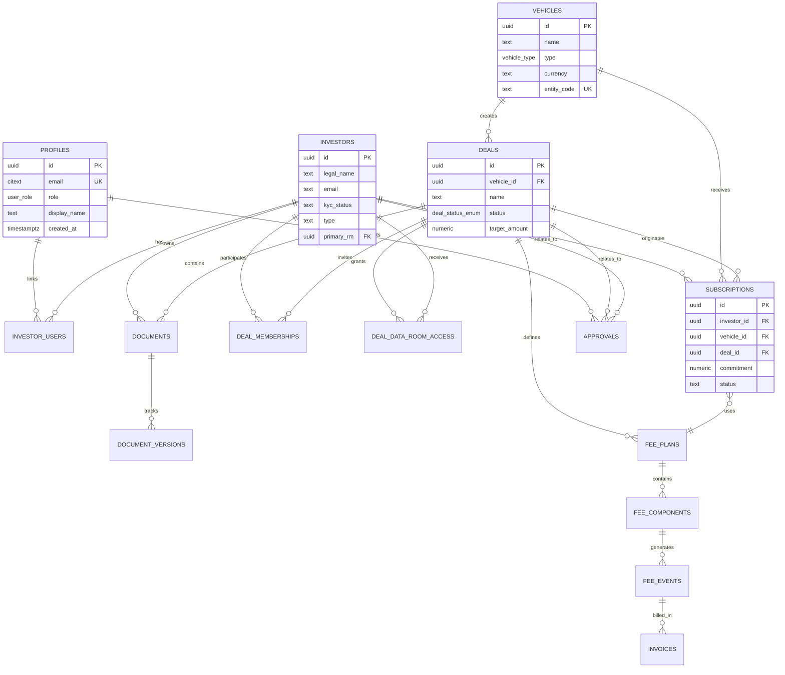

## 2. Investment Entity Details

### Vehicles (Investment Structures)

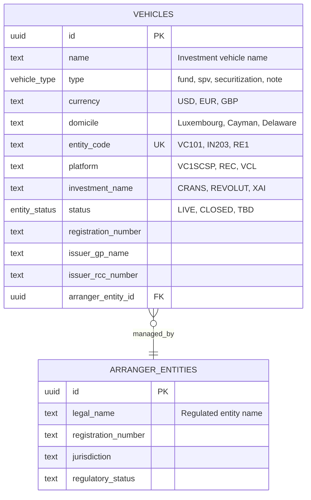

### Subscriptions (Investor Commitments)

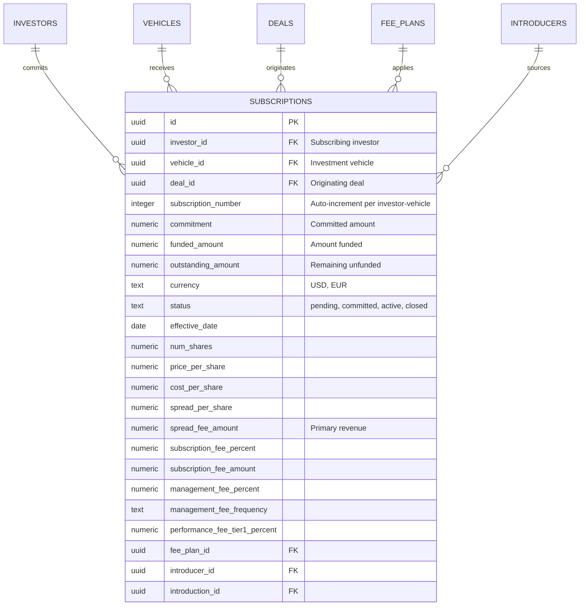

## 3. Deal Management Model

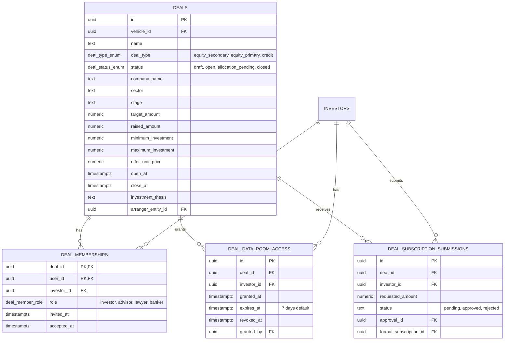

## 4. Fee Accounting Model

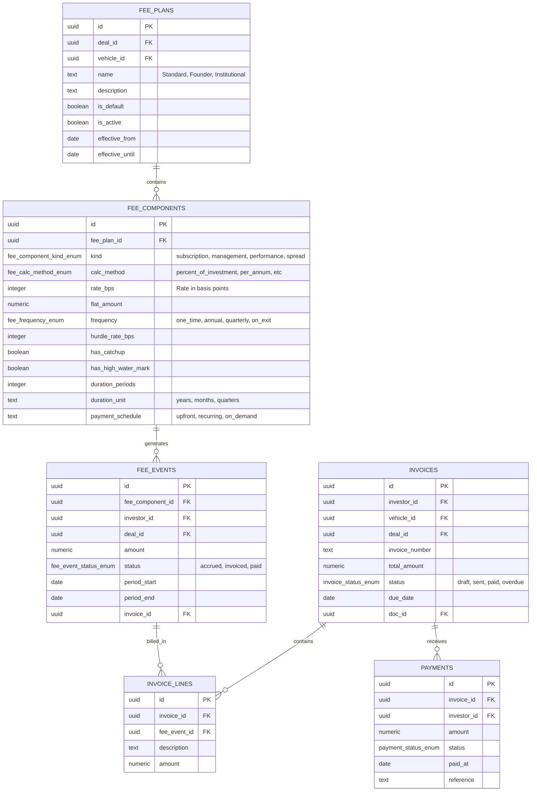

## 5. Document Management Model

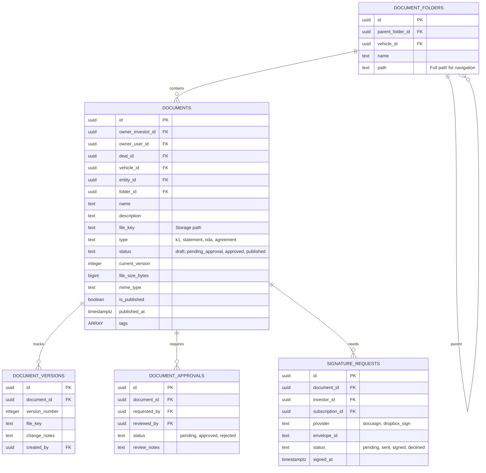

## 6. Approval Workflow Model

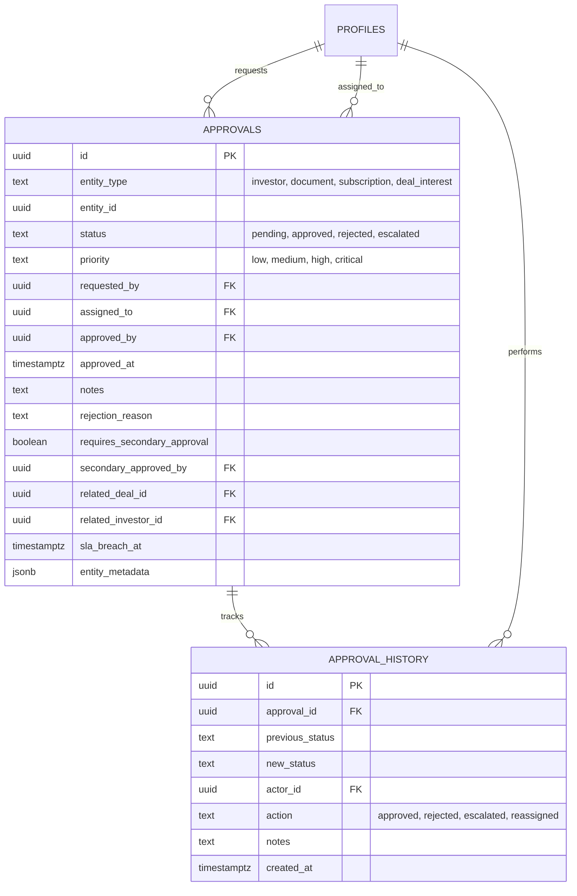

## 7. Messaging Model

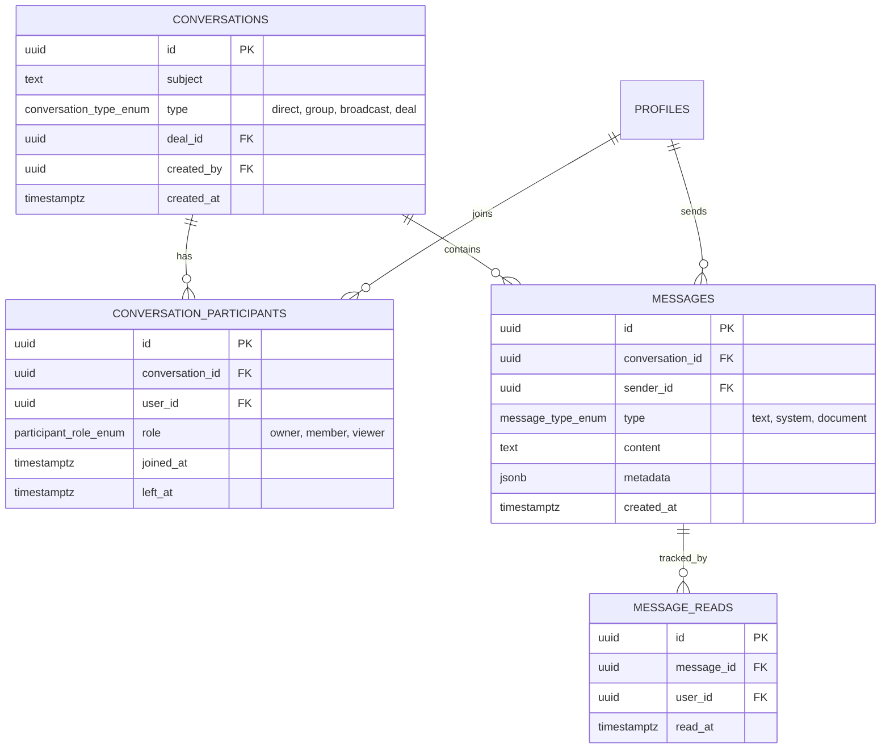

## 8. Audit & Compliance Model

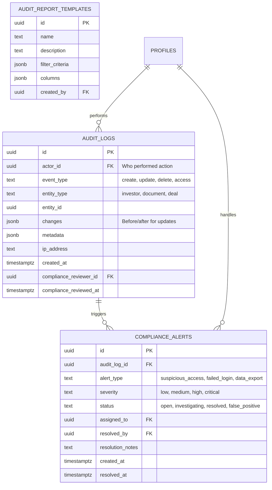

## 9. Introducer & Commission Model

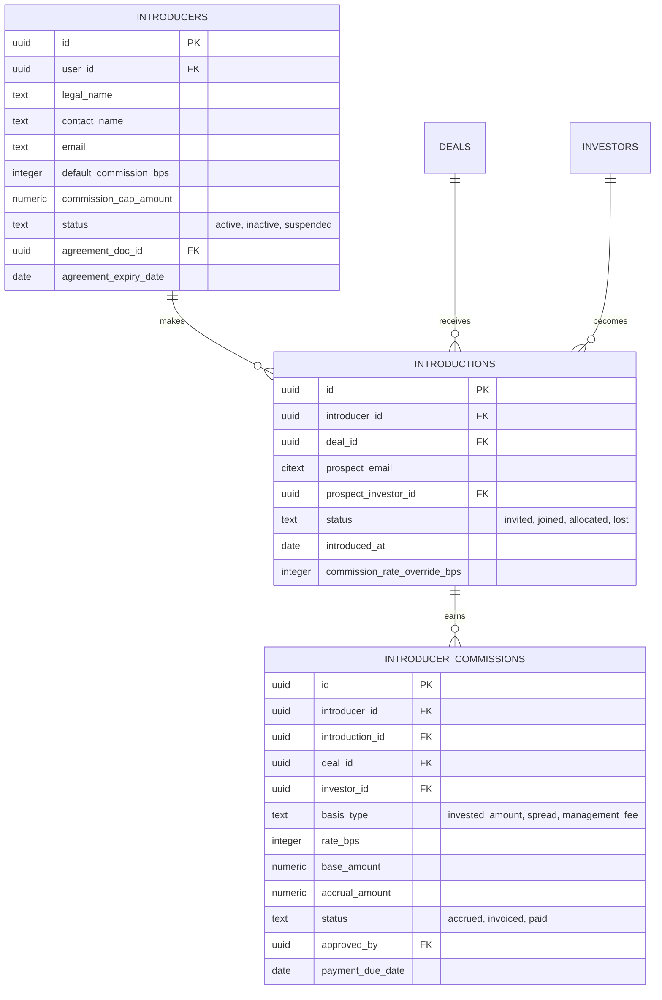

## 10. Workflow & Automation Model

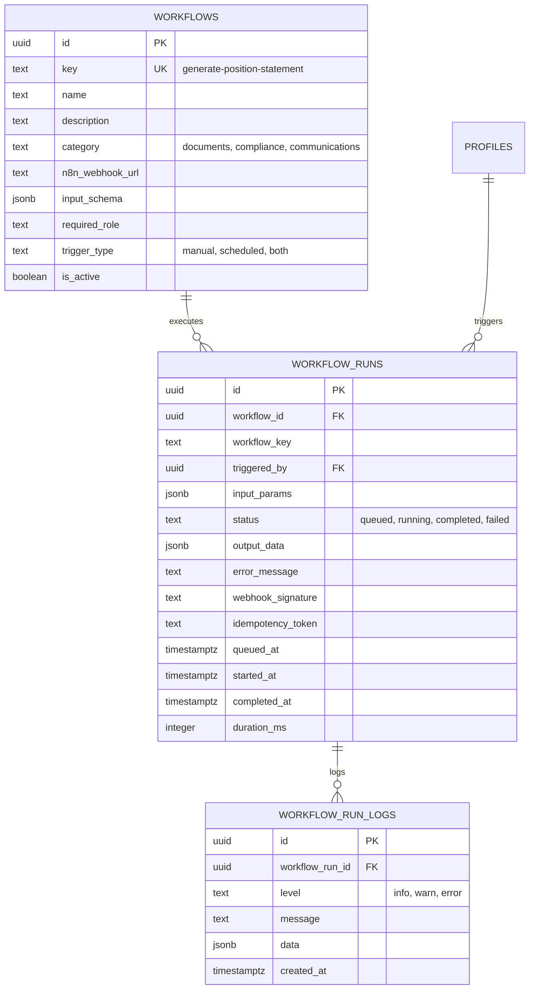

## Database Statistics

| Category | Tables | Total Records |
|----------|--------|---------------|
| Identity | 3 | ~400 |
| Investments | 10 | ~750 |
| Fees | 8 | ~100 |
| Documents | 6 | ~50 |
| Approvals | 2 | ~70 |
| Messaging | 4 | ~200 |
| Audit | 3 | ~1000 |
| Workflow | 3 | ~60 |
| **Total** | **48** | **~2500** |

## Key Relationships

### One-to-Many Relationships

| Parent | Child | Relationship |
|--------|-------|--------------|
| `vehicles` | `deals` | Vehicle can have multiple deals |
| `investors` | `subscriptions` | Investor can have multiple subscriptions |
| `deals` | `documents` | Deal has many data room documents |
| `fee_plans` | `fee_components` | Fee plan has multiple fee types |
| `invoices` | `invoice_lines` | Invoice has multiple line items |

### Many-to-Many Relationships

| Table A | Junction | Table B |
|---------|----------|---------|
| `profiles` | `investor_users` | `investors` |
| `deals` | `deal_memberships` | `investors` |
| `conversations` | `conversation_participants` | `profiles` |

### Self-Referencing Relationships

| Table | Relationship |
|-------|--------------|
| `document_folders` | `parent_folder_id` → `id` |
| `vehicles` | Parent company → subsidiaries |
| `fee_components` | `next_tier_component_id` → `id` |
