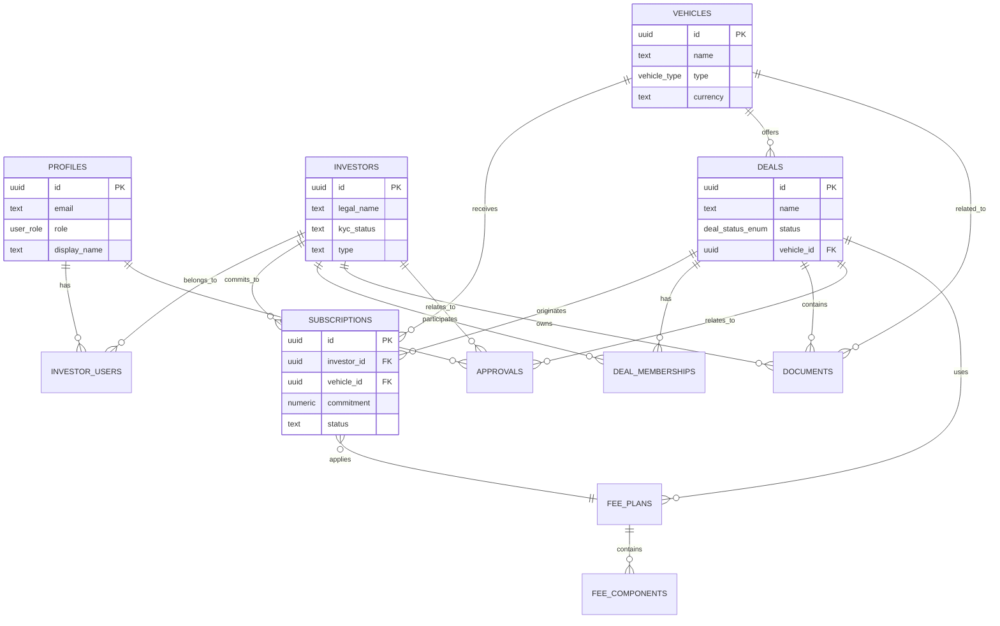

# VERSO Holdings - System Architecture Diagrams

This document contains all major architecture diagrams in Mermaid format for the VERSO Holdings Platform.

## 1. High-Level System Overview

```mermaid
graph TB
    subgraph Users["Users"]
        INV[("👤 Investors")]
        STAFF[("👤 Staff")]
        INTRO[("👤 Introducers")]
    end

    subgraph Platform["VERSO Holdings Platform"]
        direction TB
        WEB["🌐 Next.js Web App<br/>Vercel"]
        API["⚡ API Routes"]
        MW["🔐 Auth Middleware"]
    end

    subgraph Supabase["Supabase Cloud"]
        direction TB
        DB[("🗄️ PostgreSQL<br/>+ RLS")]
        AUTH["🔑 Auth Service"]
        STORAGE["📁 Object Storage"]
        RT["📡 Realtime"]
    end

    subgraph External["External Services"]
        N8N["🔄 n8n Workflows"]
        ESIGN["✍️ E-Signature"]
        EMAIL["📧 Email Service"]
    end

    INV --> WEB
    STAFF --> WEB
    INTRO --> WEB

    WEB --> MW
    MW --> API
    MW --> AUTH

    API --> DB
    API --> STORAGE
    WEB --> RT
    RT --> DB

    API <--> N8N
    API <--> ESIGN
    API --> EMAIL

    classDef primary fill:#4F46E5,color:#fff,stroke:#4F46E5
    classDef secondary fill:#0EA5E9,color:#fff,stroke:#0EA5E9
    classDef external fill:#10B981,color:#fff,stroke:#10B981
    classDef storage fill:#8B5CF6,color:#fff,stroke:#8B5CF6

    class WEB,API,MW primary
    class DB,AUTH,STORAGE,RT secondary
    class N8N,ESIGN,EMAIL external
```

## 2. Dual-Portal Architecture

## 3. Authentication Flow

## 4. Deal Subscription Workflow

## 5. Data Flow - Investor Dashboard

## 6. Fee Processing Flow

## 7. Document Lifecycle

## 8. Workflow Integration

## 9. Entity Relationship Diagram (Core Entities)

## 10. Deployment Architecture

## 11. Security Layers

## 12. Real-time Communication

## Usage Notes

### Viewing Diagrams

These diagrams are written in [Mermaid](https://mermaid.js.org/) syntax and can be rendered:

1. **GitHub**: Automatically renders in markdown files
2. **VS Code**: Use Mermaid preview extension
3. **Mermaid Live Editor**: https://mermaid.live/
4. **Documentation Tools**: Docusaurus, GitBook, etc.

### Exporting Diagrams

To export as images:

1. Use Mermaid Live Editor → Export as PNG/SVG
2. Use mermaid-cli: `mmdc -i diagram.mmd -o diagram.png`
3. Use VS Code extension export feature

### Updating Diagrams

When updating architecture:

1. Update relevant diagrams in this file
2. Reference changes in ADRs if significant
3. Update C4 model documentation if structure changes
