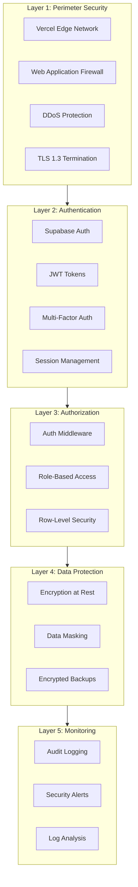
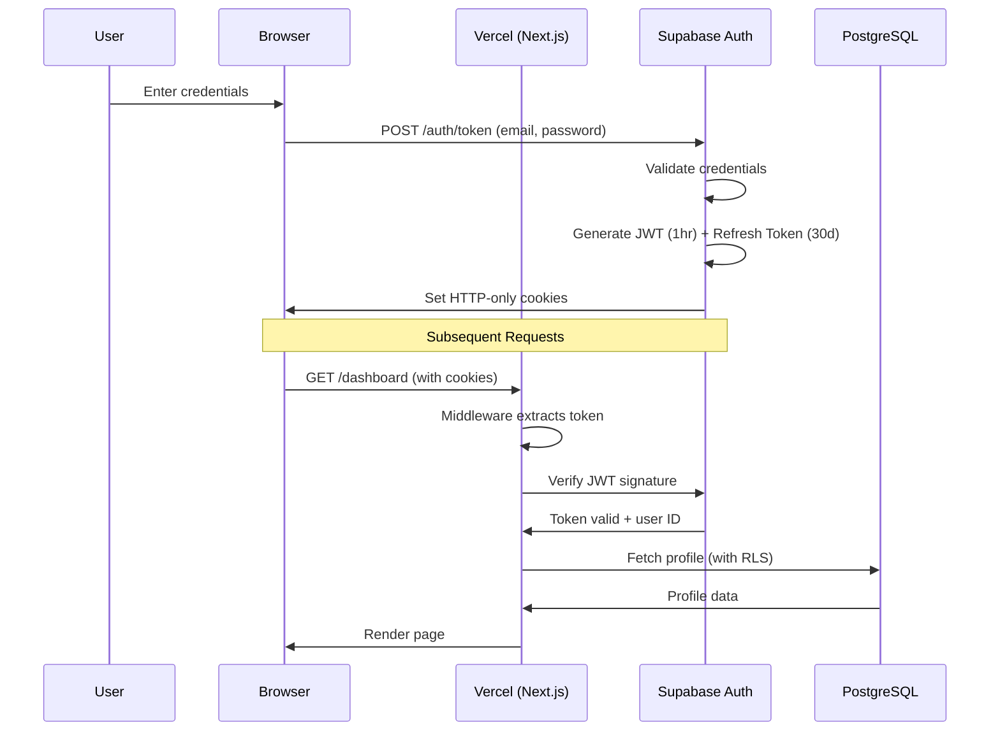

# VERSO Holdings - Security Architecture

**Version**: 1.0
**Date**: December 2025
**Classification**: Internal

---

## Executive Summary

This document describes the security architecture for the VERSO Holdings Platform, an investment management system handling sensitive financial data for institutional and high-net-worth investors.

### Security Objectives

1. **Confidentiality**: Protect investor data from unauthorized access
2. **Integrity**: Ensure data accuracy and prevent unauthorized modifications
3. **Availability**: Maintain system uptime for business operations
4. **Compliance**: Meet regulatory requirements (GDPR, SOC 2)
5. **Auditability**: Maintain complete audit trails for all operations

---

## 1. Security Architecture Overview



---

## 2. Authentication Architecture

### 2.1 Authentication Flow



### 2.2 Token Management

| Token Type | Lifetime | Storage | Refresh |
|------------|----------|---------|---------|
| Access Token | 1 hour | HTTP-only cookie | Auto-refresh via middleware |
| Refresh Token | 30 days | HTTP-only cookie | Rotated on use |

### 2.3 Session Security

```typescript
// Secure cookie configuration
const cookieOptions = {
  httpOnly: true,      // Prevent XSS access
  secure: true,        // HTTPS only
  sameSite: 'lax',     // CSRF protection
  path: '/',
  maxAge: 3600,        // 1 hour
};
```

### 2.4 Multi-Factor Authentication

- **Staff**: Strongly recommended (configurable per organization)
- **Investors**: Optional, enabled via profile settings
- **Methods**: TOTP (Google Authenticator, Authy)

---

## 3. Authorization Architecture

### 3.1 Role-Based Access Control (RBAC)

| Role | Portal Access | Permissions |
|------|--------------|-------------|
| `investor` | `/versoholdings/*` | View own portfolio, documents; submit interests; manage profile |
| `staff_admin` | `/versotech/staff/*` | All operations; user management; system configuration |
| `staff_ops` | `/versotech/staff/*` | Deal management; investor relations; document processing |
| `staff_rm` | `/versotech/staff/*` | Assigned investor management; KYC review; communications |

### 3.2 Middleware Authorization

```typescript
// middleware.ts
export async function middleware(req: NextRequest) {
  const user = await getUser(req);
  const path = req.nextUrl.pathname;

  // Portal boundary enforcement
  if (path.startsWith('/versoholdings/')) {
    if (!user || user.role !== 'investor') {
      return redirect('/versoholdings/login');
    }
  }

  if (path.startsWith('/versotech/staff/')) {
    if (!user || !user.role?.startsWith('staff_')) {
      return redirect('/versotech/login');
    }
  }

  // Role-specific page restrictions
  const adminOnlyPaths = ['/versotech/staff/admin'];
  if (adminOnlyPaths.some(p => path.startsWith(p))) {
    if (user.role !== 'staff_admin') {
      return redirect('/versotech/staff/dashboard');
    }
  }
}
```

### 3.3 Row-Level Security (RLS)

Database-level access control ensures data isolation even if application code has vulnerabilities.

#### Investor Data Isolation

```sql
-- Investors can only see their own data
CREATE POLICY "investors_own_data" ON investors
    FOR SELECT
    USING (
        id IN (
            SELECT investor_id
            FROM investor_users
            WHERE user_id = auth.uid()
        )
    );

-- Investors can only see their own subscriptions
CREATE POLICY "investor_subscriptions" ON subscriptions
    FOR SELECT
    USING (
        investor_id IN (
            SELECT investor_id
            FROM investor_users
            WHERE user_id = auth.uid()
        )
    );

-- Staff can see all data
CREATE POLICY "staff_view_all" ON investors
    FOR ALL
    USING (
        EXISTS (
            SELECT 1 FROM profiles
            WHERE id = auth.uid()
            AND role LIKE 'staff_%'
        )
    );
```

#### Document Access Control

```sql
-- Investors see own documents OR published deal documents with active access
CREATE POLICY "investor_documents" ON documents
    FOR SELECT
    USING (
        -- Own documents
        owner_investor_id IN (
            SELECT investor_id FROM investor_users WHERE user_id = auth.uid()
        )
        OR
        -- Published deal documents with active data room access
        (
            is_published = true
            AND deal_id IN (
                SELECT deal_id FROM deal_data_room_access
                WHERE investor_id IN (
                    SELECT investor_id FROM investor_users WHERE user_id = auth.uid()
                )
                AND (expires_at IS NULL OR expires_at > now())
                AND revoked_at IS NULL
            )
        )
    );
```

---

## 4. Data Protection

### 4.1 Encryption

| Layer | Type | Algorithm |
|-------|------|-----------|
| In Transit | TLS | TLS 1.3 (ECDHE, AES-256-GCM) |
| At Rest (Database) | Supabase Managed | AES-256 |
| At Rest (Storage) | S3 Server-Side | AES-256 |
| Backups | Encrypted | AES-256 |

### 4.2 Sensitive Data Handling

```typescript
// PII fields that require special handling
const sensitiveFields = [
  'tax_residency',
  'entity_identifier',
  'bank_account_number',
  'national_id',
  'passport_number',
];

// Audit logging includes hashed values, not raw data
function logSensitiveAccess(field: string, value: string) {
  const hash = crypto.createHash('sha256').update(value).digest('hex');
  auditLog({
    event: 'sensitive_field_accessed',
    field,
    valueHash: hash.substring(0, 16), // First 16 chars for correlation
  });
}
```

### 4.3 Document Security

- **Watermarking**: Investor-specific watermarks on downloaded documents
- **Signed URLs**: Time-limited download links (15 minutes default)
- **Access Logging**: All document downloads logged with IP and timestamp
- **Virus Scanning**: Uploaded files scanned before storage

---

## 5. API Security

### 5.1 API Authentication

All API routes require authentication:

```typescript
// app/api/deals/route.ts
export async function GET(req: Request) {
  const supabase = await createClient();
  const { data: { user }, error } = await supabase.auth.getUser();

  if (!user || error) {
    return Response.json({ error: 'Unauthorized' }, { status: 401 });
  }

  // RLS automatically filters data based on user
  const { data: deals } = await supabase
    .from('deals')
    .select('*')
    .eq('status', 'open');

  return Response.json(deals);
}
```

### 5.2 Input Validation

All inputs validated with Zod schemas:

```typescript
import { z } from 'zod';

const createDealSchema = z.object({
  name: z.string().min(1).max(255),
  vehicle_id: z.string().uuid(),
  target_amount: z.number().positive(),
  minimum_investment: z.number().positive(),
  status: z.enum(['draft', 'open']).default('draft'),
});

export async function POST(req: Request) {
  const body = await req.json();

  const result = createDealSchema.safeParse(body);
  if (!result.success) {
    return Response.json(
      { error: 'Validation failed', details: result.error.issues },
      { status: 400 }
    );
  }

  // Proceed with validated data
}
```

### 5.3 Rate Limiting

| Endpoint Category | Rate Limit | Window |
|------------------|------------|--------|
| Authentication | 5 requests | 1 minute |
| API (authenticated) | 100 requests | 1 minute |
| File uploads | 10 requests | 1 minute |
| Webhooks | 50 requests | 1 minute |

### 5.4 CORS Configuration

```typescript
// next.config.js
const corsHeaders = {
  'Access-Control-Allow-Origin': process.env.NEXT_PUBLIC_APP_URL,
  'Access-Control-Allow-Methods': 'GET, POST, PUT, DELETE, OPTIONS',
  'Access-Control-Allow-Headers': 'Content-Type, Authorization',
  'Access-Control-Allow-Credentials': 'true',
};
```

---

## 6. Webhook Security

### 6.1 HMAC Signature Verification

All webhooks use HMAC-SHA256 signatures:

```typescript
// Outbound (Platform → External)
export async function signWebhookPayload(payload: object): Promise<string> {
  return crypto
    .createHmac('sha256', process.env.N8N_OUTBOUND_SECRET!)
    .update(JSON.stringify(payload))
    .digest('hex');
}

// Inbound (External → Platform)
export async function verifyWebhookSignature(
  signature: string,
  rawBody: string
): Promise<boolean> {
  const expected = crypto
    .createHmac('sha256', process.env.N8N_INBOUND_SECRET!)
    .update(rawBody)
    .digest('hex');

  return crypto.timingSafeEqual(
    Buffer.from(signature),
    Buffer.from(expected)
  );
}
```

### 6.2 Webhook Security Headers

```typescript
// Outbound webhook headers
const headers = {
  'Content-Type': 'application/json',
  'X-Verso-Signature': signature,
  'X-Idempotency-Key': idempotencyToken,
  'X-Timestamp': Date.now().toString(),
};
```

---

## 7. Audit Logging

### 7.1 Audit Log Schema

```sql
CREATE TABLE audit_logs (
    id uuid PRIMARY KEY DEFAULT gen_random_uuid(),
    actor_id uuid REFERENCES profiles(id),
    event_type text NOT NULL,  -- 'create', 'read', 'update', 'delete'
    entity_type text NOT NULL, -- 'investor', 'document', 'deal'
    entity_id uuid,
    changes jsonb,             -- {before: {...}, after: {...}}
    metadata jsonb,            -- Additional context
    ip_address text,
    user_agent text,
    created_at timestamptz DEFAULT now()
);
```

### 7.2 Logged Events

| Category | Events |
|----------|--------|
| Authentication | Login, logout, password change, MFA enable/disable, failed login |
| Authorization | Access denied, role change, permission grant/revoke |
| Data Access | Document download, portfolio view, report generation |
| Data Modification | Investor update, subscription create, fee change |
| Administrative | User invite, workflow trigger, configuration change |
| Security | Invalid signature, rate limit exceeded, suspicious pattern |

### 7.3 Audit Log Integrity

```sql
-- Hash chain for immutability
CREATE TABLE audit_log_hash_chain (
    id uuid PRIMARY KEY,
    audit_log_id uuid REFERENCES audit_logs(id),
    previous_hash text,
    current_hash text,
    created_at timestamptz DEFAULT now()
);

-- Hash includes previous hash for chain integrity
CREATE OR REPLACE FUNCTION compute_audit_hash(log_id uuid)
RETURNS text AS $$
DECLARE
    log_data jsonb;
    prev_hash text;
BEGIN
    SELECT to_jsonb(a.*) INTO log_data FROM audit_logs a WHERE id = log_id;
    SELECT current_hash INTO prev_hash FROM audit_log_hash_chain
        ORDER BY created_at DESC LIMIT 1;

    RETURN encode(
        sha256((COALESCE(prev_hash, '') || log_data::text)::bytea),
        'hex'
    );
END;
$$ LANGUAGE plpgsql;
```

---

## 8. Compliance Monitoring

### 8.1 Compliance Alerts

```sql
CREATE TABLE compliance_alerts (
    id uuid PRIMARY KEY DEFAULT gen_random_uuid(),
    audit_log_id uuid REFERENCES audit_logs(id),
    alert_type text NOT NULL,
    severity text NOT NULL,  -- 'low', 'medium', 'high', 'critical'
    status text DEFAULT 'open',
    assigned_to uuid REFERENCES profiles(id),
    resolved_by uuid REFERENCES profiles(id),
    resolution_notes text,
    created_at timestamptz DEFAULT now(),
    resolved_at timestamptz
);
```

### 8.2 Alert Types

| Type | Trigger | Severity |
|------|---------|----------|
| `suspicious_access` | Access from new location/device | Medium |
| `failed_login_burst` | 5+ failed logins in 5 minutes | High |
| `bulk_data_access` | >100 records accessed in 1 minute | Medium |
| `privilege_escalation` | Role change to admin | Critical |
| `sensitive_data_export` | Large document download | Medium |
| `after_hours_access` | Access outside business hours | Low |

### 8.3 Automated Responses

```typescript
// Automated security responses
const securityResponses = {
  failed_login_burst: async (userId: string) => {
    await lockAccount(userId, { duration: '15m' });
    await notifySecurityTeam('Account locked due to failed logins', userId);
  },

  privilege_escalation: async (userId: string) => {
    await createComplianceAlert('privilege_escalation', userId, 'critical');
    await notifySecurityTeam('Admin role granted', userId);
  },

  bulk_data_access: async (userId: string) => {
    await createComplianceAlert('bulk_data_access', userId, 'medium');
    // Log but don't block
  },
};
```

---

## 9. Security Best Practices

### 9.1 Code Security

- **Dependency Scanning**: Automated npm audit on every build
- **Secret Detection**: Pre-commit hooks for secret scanning
- **Code Review**: Required for all changes to auth/security code
- **Static Analysis**: ESLint security rules enforced

### 9.2 Infrastructure Security

- **Environment Variables**: Secrets in environment, never in code
- **Secret Rotation**: Quarterly rotation of API keys and secrets
- **Least Privilege**: Minimal permissions for service accounts
- **Network Isolation**: Database not publicly accessible

### 9.3 Operational Security

- **Incident Response**: Documented procedures for security incidents
- **Security Training**: Annual security awareness training
- **Penetration Testing**: Annual third-party security assessment
- **Backup Testing**: Quarterly backup restoration tests

---

## 10. Security Checklist

### New Feature Checklist

- [ ] Authentication required for all endpoints
- [ ] Authorization checks for all operations
- [ ] RLS policies created for new tables
- [ ] Input validation with Zod schemas
- [ ] Audit logging for sensitive operations
- [ ] Rate limiting considered
- [ ] Error messages don't leak sensitive data

### Deployment Checklist

- [ ] Environment variables verified
- [ ] HTTPS enforced
- [ ] Security headers configured
- [ ] RLS policies tested
- [ ] Audit logging verified
- [ ] Monitoring alerts configured

---

## References

- [Supabase Security](https://supabase.com/docs/guides/auth/row-level-security)
- [OWASP Top 10](https://owasp.org/www-project-top-ten/)
- [Next.js Security](https://nextjs.org/docs/advanced-features/security-headers)
- [ADR-003: Row-Level Security](./adr/ADR-003-row-level-security.md)
